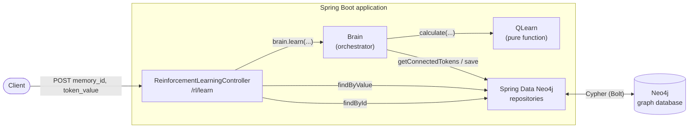
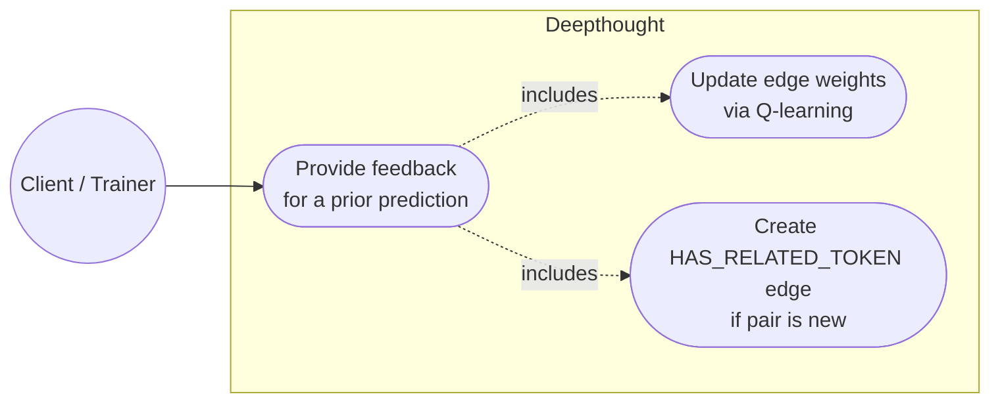
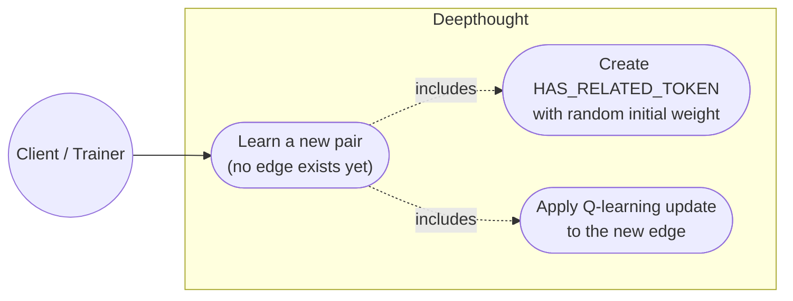
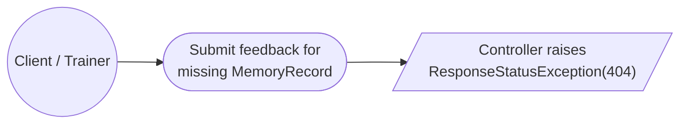
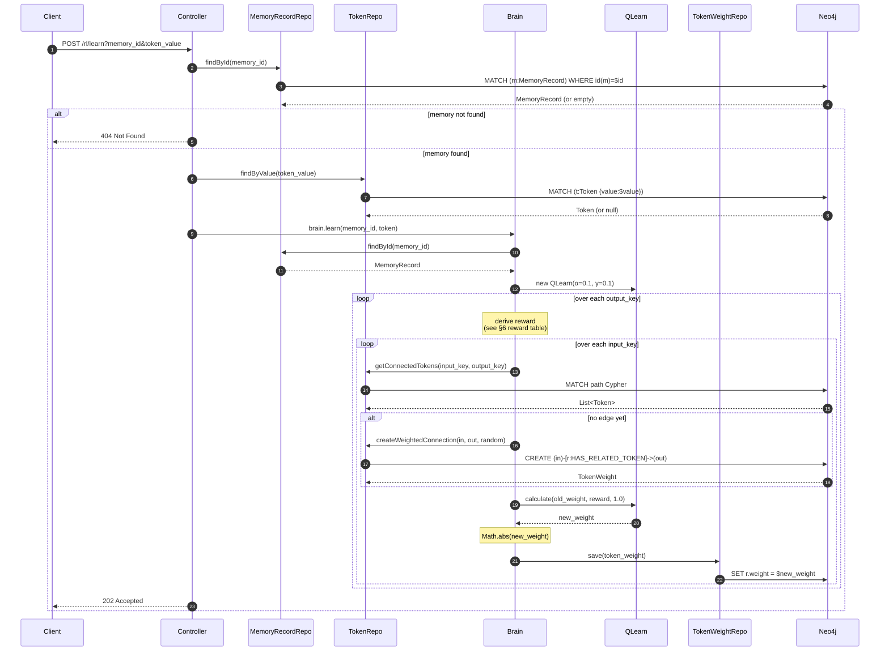
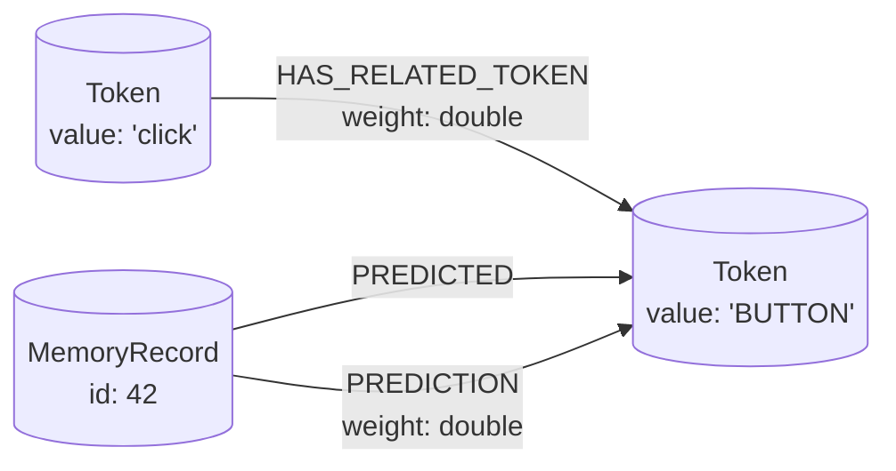
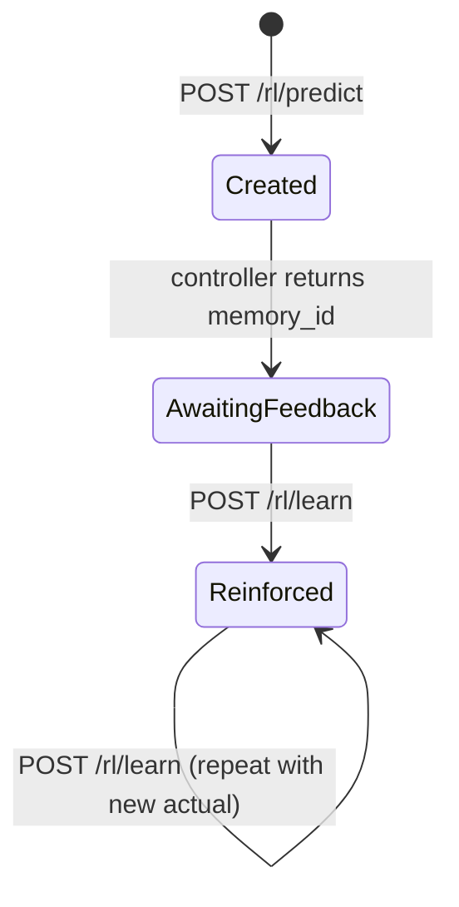

# `/rl/learn` — Endpoint Walkthrough

This document explains exactly what happens when a client sends a request to Deepthought's learn endpoint. It covers the HTTP contract, the request lifecycle, the Q-learning math, the Neo4j writes, and operational procedures for verifying and debugging the flow.

If you're new to Deepthought, read [`API_SPEC.md`](./API_SPEC.md) first for a high-level tour of all endpoints. This document goes deep on `/rl/learn` only.

---

## 1. Overview

Deepthought is a graph-based reinforcement learner. Predictions and learning are split across two endpoints that work as a pair:

1. **`POST /rl/predict`** generates a prediction and *persists a `MemoryRecord`* describing the inputs, the candidate output labels, and the model's best guess.
2. **`POST /rl/learn`** takes the `memory_id` returned by the predict step and the *actual* (correct) token, computes a reward, and adjusts the weighted graph edges that contributed to the prediction.

`/rl/learn` is therefore **stateful**: it cannot be called in isolation. A `MemoryRecord` must already exist in Neo4j, otherwise the endpoint returns `404`.

---

## 2. Endpoint contract

| Property | Value |
|---|---|
| Method | `POST` |
| Path | `/rl/learn` |
| Query parameters | `memory_id` (long, required), `token_value` (String, required) |
| Request body | _(none — parameters are URL-encoded)_ |
| Success status | `202 Accepted` (empty body) |
| Error status | `404 Not Found` when `memory_id` does not match a stored `MemoryRecord` |

Source: `src/main/java/com/deepthought/api/ReinforcementLearningController.java:177-196`.

### Example — successful call

```bash
curl -i -X POST \
  "http://localhost:8080/rl/learn?memory_id=42&token_value=VERB"
```

```
HTTP/1.1 202 Accepted
Content-Length: 0
```

### Example — unknown memory

```bash
curl -i -X POST \
  "http://localhost:8080/rl/learn?memory_id=999999&token_value=VERB"
```

```
HTTP/1.1 404 Not Found
{"timestamp":"...","status":404,"error":"Not Found",
 "message":"Memory record not found for id 999999"}
```

---

## 3. High-level architecture



Four collaborators participate:

- **Controller** — Spring REST entry point. Validates the `memory_id` and resolves `token_value` to a `Token` node.
- **Brain** (`@Component`) — orchestrates the learning loop, manages reward computation, and writes weight updates.
- **QLearn** — a stateless pure function: given an old weight, an immediate reward, and a future-reward estimate, returns the new weight.
- **Spring Data Neo4j repositories** — translate method calls into Cypher and execute them over Bolt.

---

## 4. Use case diagrams

### Primary use case — provide feedback to refine the model



**Preconditions:** A `MemoryRecord` was created by a prior `POST /rl/predict` call and the client has its `memory_id`.
**Postconditions:** Every `(input_token)-[HAS_RELATED_TOKEN]->(output_token)` edge that contributed to the prediction has its `weight` updated. (The `MemoryRecord` itself is *not* re-saved during learn — see §10 for the in-memory-only `setDesiredToken` quirk.)

### Secondary use case — bootstrap an unseen input→output pair



This is the cold-start path. When `getConnectedTokens` finds no existing edge between an input and an output, `Brain.learn` calls `createWeightedConnection` with `Random.nextDouble()` as the seed weight, then runs the Q-learning update on top of it (`Brain.java:132-146`).

### Exception use case — stale or invalid memory_id



The controller checks `optional_memory.isPresent()` before invoking the brain. A missing record yields HTTP 404 with the offending `memory_id` in the error message.

---

## 5. Sequence of a learn request



Step references (controller → brain):

| # | Code site | What happens |
|---|---|---|
| 1 | `ReinforcementLearningController.java:183` | `memory_repo.findById(memory_id)` |
| 2 | `ReinforcementLearningController.java:184-186` | 404 if absent |
| 3 | `ReinforcementLearningController.java:189-193` | Resolve `token_value` to a persisted `Token` if possible; otherwise build a transient one |
| 4 | `ReinforcementLearningController.java:195` | `brain.learn(memory_id, token)` |
| 5 | `Brain.java:80-83` | Re-fetch the memory inside the brain |
| 6 | `Brain.java:87-97` | Initialise Q-learning constants and `QLearn` instance |
| 7 | `Brain.java:98-123` | Outer loop computes the reward for the current `output_key` |
| 8 | `Brain.java:126-146` | Inner loop updates one edge per `input_key` |

---

## 6. Q-learning algorithm

`QLearn.calculate` is one line of arithmetic (`QLearn.java:30-32`):

```java
public double calculate(double old_value, double actual_reward, double estimated_future_reward){
    return (old_value + learning_rate * (actual_reward + (discount_factor * estimated_future_reward)));
}
```

Which is the standard Q-learning update:

```
Q_new = Q_old + α · (R + γ · Q_future)
```

Constants used by `Brain.learn` (`Brain.java:87-97`):

| Symbol | Code value | Meaning |
|---|---|---|
| α (learning_rate) | `0.1` | How much new evidence shifts the weight |
| γ (discount_factor) | `0.1` | Weight given to future rewards |
| Q_future (estimated_reward) | `1.0` (constant) | Hard-coded — not derived from a successor state |

### Reward table

The reward `R` for a given `(output_key, predicted_token, actual_token)` triple is determined by `Brain.java:101-123`:

| Condition (in evaluation order) | Reward |
|---|---|
| `output_key == actual_token` **and** `actual_token == predicted_token` | **+2.0** |
| `output_key == actual_token` (predicted was different) | **+1.0** |
| `output_key == predicted_token` **and** `actual_token != output_key` | **−1.0** |
| `output_key != actual_token` (else branch) | **−2.0** |
| any remaining case | **0.0** |

> **Caveat:** the trailing `else` (reward 0.0) is unreachable given the branch ordering — the prior `else if` already matches every case where `output_key != actual_token`. It's defensive code only.

### Worked example

Suppose:
- old weight `Q_old = 0.50`
- actual_token matches both predicted_token and output_key → `R = +2.0`
- α = 0.1, γ = 0.1, Q_future = 1.0

```
Q_new = 0.50 + 0.1 · (2.0 + 0.1 · 1.0)
      = 0.50 + 0.1 · 2.1
      = 0.50 + 0.21
      = 0.71
```

The new weight `0.71` is then passed through `Math.abs(...)` (`Brain.java:141`) before being saved.

> **Caveat — `Math.abs` masks negative learning signal.** With α=γ=0.1 and Q_future=1.0, a punishing reward of −2.0 yields `0.5 + 0.1·(−2.0 + 0.1) = 0.31` — still positive. But for low old weights and large negative rewards (e.g. `Q_old = 0.1`, `R = −2.0` ⇒ `−0.09`), the absolute value flips the sign and the edge actually *grows* in magnitude after a penalty. Be aware of this if you are tuning rewards or learning rates.

---

## 7. Neo4j graph effects

### Schema touched by `/rl/learn`



- **`HAS_RELATED_TOKEN`** edges are the learnable weights — they are read and written on every learn call. This is the *only* relationship type that `/rl/learn` writes to Neo4j.
- **`PREDICTED`** and **`PREDICTION`** are written by `/rl/predict` and only *read* during learn.
- **`DESIRED_TOKEN`** — `Brain.learn` calls `memory.setDesiredToken(actual_token)` on the in-memory `MemoryRecord` (`Brain.java:127`), but **never calls `memory_repo.save(memory)`**, so this relationship is *not* persisted to Neo4j today. The mutation is effectively dead code; see §10. The schema diagram above intentionally omits it for that reason.

### Cypher executed during a learn call

| Source | Cypher | Purpose |
|---|---|---|
| `MemoryRecordRepository.findById` (inherited) | `MATCH (m:MemoryRecord) WHERE id(m)=$id RETURN m, ...` | Load memory + relations |
| `TokenRepository.findByValue` | `MATCH (t:Token {value:$value}) RETURN t` | Resolve token by string |
| `TokenRepository.getConnectedTokens` | `MATCH p=(f1:Token{value:$input_value})-[fw:HAS_RELATED_TOKEN]->(f2:Token{value:$output_value}) RETURN f1,fw,f2` | Read existing weighted edge |
| `TokenRepository.createWeightedConnection` | `MATCH (f_in:Token),(f_out:Token) WHERE f_in.value=$input_value AND f_out.value=$output_value CREATE (f_in)-[r:HAS_RELATED_TOKEN{weight:$weight}]->(f_out) RETURN r` | Cold-start: create new edge |
| `TokenWeightRepository.save` (inherited) | `SET r.weight = $weight` (against the matched relationship) | Persist the Q-learning update |

### Before and after

Suppose `MemoryRecord 42` has `input_token_values = ["click"]`, `output_token_values = ["BUTTON","LINK"]`, `predicted_token = BUTTON`, and we call `POST /rl/learn?memory_id=42&token_value=BUTTON`.

**Before:**
```
(click) -[HAS_RELATED_TOKEN {weight: 0.30}]-> (BUTTON)
(click) -[HAS_RELATED_TOKEN {weight: 0.55}]-> (LINK)
(MemoryRecord 42) -[PREDICTED]-> (BUTTON)
```

**After:**
```
(click) -[HAS_RELATED_TOKEN {weight: 0.51}]-> (BUTTON)   # 0.30 + 0.1·(2.0 + 0.1) = 0.51, then |…|
(click) -[HAS_RELATED_TOKEN {weight: 0.36}]-> (LINK)     # 0.55 + 0.1·(-2.0 + 0.1) = 0.36, then |…|
(MemoryRecord 42) -[PREDICTED]-> (BUTTON)
```

Only the two `HAS_RELATED_TOKEN` weights change. `Brain.learn` does call `memory.setDesiredToken(actual_token)` in memory, but never re-saves the `MemoryRecord`, so no `DESIRED_TOKEN` relationship is written (see §10).

The reward for the `LINK` row is −2.0 because `output_key="LINK"` is not the actual token; for the `BUTTON` row it is +2.0 because `output_key`, `predicted_token`, and `actual_token` all match.

---

## 8. MemoryRecord lifecycle



A `MemoryRecord` can be reinforced multiple times — each call updates the same edges further. There is no "consume" or invalidation step; the record stays in Neo4j.

---

## 9. Procedures

### Procedure A — train one example end-to-end

1. **Predict.** Send a predict request and capture the `id` from the returned `MemoryRecord`:
   ```bash
   curl -s -X POST "http://localhost:8080/rl/predict" \
     --data-urlencode 'input={"event":"click"}' \
     --data-urlencode 'output_tokens=BUTTON,LINK' \
   | jq '.id'
   ```
2. **Provide feedback.** Submit the actual token using the captured id:
   ```bash
   curl -i -X POST "http://localhost:8080/rl/learn?memory_id=<ID>&token_value=BUTTON"
   ```
   Expect `202 Accepted`.
3. **Inspect weights.** In Neo4j Browser:
   ```cypher
   MATCH (a:Token)-[r:HAS_RELATED_TOKEN]->(b:Token)
   RETURN a.value, r.weight, b.value
   ORDER BY r.weight DESC
   LIMIT 20;
   ```

### Procedure B — verify a learn call had effect

Run this query before and after the learn call and confirm `r.weight` changed:

```cypher
MATCH (a:Token {value: 'click'})-[r:HAS_RELATED_TOKEN]->(b:Token {value: 'BUTTON'})
RETURN r.weight;
```

### Procedure C — reset learning for a token pair

Drop the edge so the next predict call re-seeds it with `Random.nextDouble()`:

```cypher
MATCH (a:Token {value: 'click'})-[r:HAS_RELATED_TOKEN]->(b:Token {value: 'BUTTON'})
DELETE r;
```

The next `/rl/predict` involving that pair will recreate the edge in `Brain.generatePolicy` (`Brain.java:230-243`).

---

## 10. Known limitations and follow-ups

These are observations from reading the code; treat them as starting points for future PRs rather than bugs to fix in passing.

1. **`setDesiredToken` is never persisted.** `Brain.learn` calls `memory.setDesiredToken(actual_token)` at `Brain.java:127` but never invokes `memory_repo.save(memory)`. With Spring Data Neo4j the entity must be explicitly saved, so the `DESIRED_TOKEN` relationship is built only in the request-scoped Java object and discarded when the call returns. If the intent is to store ground truth alongside the prediction, a `memory_repo.save(memory)` call after the inner loop would fix it.
2. **`Math.abs` on the Q update** (`Brain.java:141`) prevents weights from going negative but can also flip the sign of intended punishment — see §6 caveat.
3. **`estimated_reward` is hard-coded to 1.0** (`Brain.java:93`). Classical Q-learning derives this from the max Q value of the successor state; here `γ · Q_future` is a constant `0.1`.
4. **Unreachable `else` branch** (`Brain.java:118-123`). The preceding `else if` at line 114 already covers `output_key != actual_token`, so the trailing `else` (reward 0.0) is dead code.
5. **Implicit token persistence.** The controller (`ReinforcementLearningController.java:189`) builds a new transient `Token` when `findByValue` returns null and passes it to `brain.learn`. The token is only persisted later by `createWeightedConnection`; if no edge needs to be created the token is silently dropped.
6. **One save per edge update.** `token_weight_repo.save` runs inside the inner loop (`Brain.java:146`), so a memory with N inputs × M outputs causes N·M Bolt round-trips. Batched saves would be a worthwhile optimisation for larger inputs.
7. **`/rl/train` is a stub.** It builds a `Vocabulary` in memory but never persists it (`Brain.java:254-282`). Don't confuse it with `/rl/learn` — only `/rl/learn` writes weights.

---

## 11. Verifying this document

To confirm the behaviour described above on your machine:

1. Start Neo4j: `docker compose up -d` (uses the `docker-compose.yml` at the repo root).
2. Start the application: `mvn spring-boot:run`.
3. Open Swagger UI at <http://localhost:8080/swagger-ui.html> and confirm `POST /rl/learn` matches §2.
4. Run **Procedure A** end-to-end. After step 2 returns 202, run the Cypher in step 3 and confirm an edge for the trained pair exists with a non-zero weight.
5. Re-read `Brain.java:75-149` and `QLearn.java:30-32` to confirm the line numbers cited in §5 and §6 are still accurate after any rebases.
