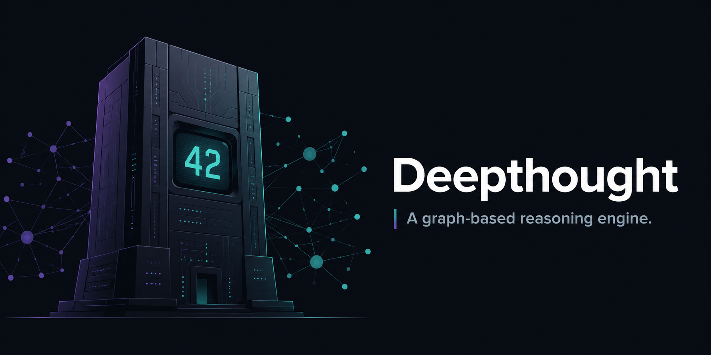

<div align="center">



# Deepthought

**A graph-based reasoning engine that distributes neural network weights across a knowledge graph — no GPU required.**

[](LICENSE)
[](https://www.oracle.com/java/)
[](https://spring.io/projects/spring-boot)
[](https://neo4j.com/)
[](https://maven.apache.org/)
[](openapi.yaml)
[](docker-compose.yml)
[](#current-status--roadmap)
[](#contributing)

[**Quick Start**](#quick-start-5-minutes) ·
[**Architecture**](#architecture) ·
[**API Reference**](#api-endpoints) ·
[**Documentation**](#documentation) ·
[**Roadmap**](#current-status--roadmap) ·
[**Contributing**](#contributing)

</div>

---

## Table of Contents

- [Why Deepthought?](#why-deepthought)
- [Quick Start (5 minutes)](#quick-start-5-minutes)
- [Documentation](#documentation)
- [Overview](#overview)
- [Architecture](#architecture)
- [Core Data Model](#core-data-model)
- [API Endpoints](#api-endpoints)
- [Project Structure](#project-structure)
- [Implementation Details](#implementation-details)
- [Development Setup](#development-setup)
- [Running with Docker](#running-with-docker)
- [Configuration](#configuration)
- [Running Tests](#running-tests)
- [Original Application: Web Mapping](#original-application-web-mapping)
- [Theoretical Foundation](#theoretical-foundation)
- [Current Status & Roadmap](#current-status--roadmap)
- [Critical Questions & Challenges](#critical-questions--challenges)
- [Contributing](#contributing)
- [Troubleshooting](#troubleshooting)
- [License](#license)
- [Citation](#citation)

---

## Why Deepthought?

Deepthought challenges the conventional approach to language models with a fundamentally different architecture: instead of dense parameter matrices that demand massive GPU compute, it distributes model weights across edges in a **graph database**. This enables **localized learning** — only the connections relevant to a training example are updated — dramatically reducing computational overhead.

| | Traditional LLMs | Deepthought |
|---|---|---|
| **Hardware** | GPU clusters | CPU-only |
| **Updates** | Global backprop | Localized edge updates |
| **Storage** | Dense matrices | Sparse graph |
| **Explainability** | Black box | Inspectable graph paths |
| **Incremental learning** | Full retrain | Add nodes/edges in place |
| **Knowledge versioning** | None | Native to graph DB |

### Core Innovation: Elastic Vectors

The system introduces **elastic vectors** — dynamic embeddings constructed on-demand from graph topology using `Token` and `Vocabulary` objects:

1. **Token Nodes** — atomic units of information (words, concepts, entities)
2. **TokenWeight Edges** — weighted connections that hold the model's learned parameters
3. **Dynamic Vector Construction** — for any token, a vector is assembled by querying connected `TokenWeight` edges, aligned via a `Vocabulary` index, zero-padded for unconnected tokens
4. **Localized Updates** — only the edges connected to tokens present in a training example are updated via Q-learning

The hypothesis: **global parameter updates are unnecessary**. By storing weights in the graph itself, the system achieves sparse, localized learning without dense matrices.

---

## Quick Start (5 minutes)

```bash
# 1. Clone the repo
git clone https://github.com/deepthought42/Deepthought.git
cd Deepthought

# 2. Start Neo4j + the app with Docker Compose
docker compose up --build -d

# 3. Make a prediction
curl -X POST "http://localhost:8080/rl/predict?input=%7B%22field%22%3A%22value%22%7D&output_tokens=approve&output_tokens=reject"

# 4. Provide feedback so the model learns
curl -X POST "http://localhost:8080/rl/learn?memory_id=1&token_value=approve"
```

That's it. You now have a running graph-based reasoning engine.

- **App:** http://localhost:8080
- **Swagger UI:** http://localhost:8080/swagger-ui.html
- **Neo4j Browser:** http://localhost:7474 (default creds: `neo4j` / `password`)

---

## Documentation

Deepthought ships with focused, deep-dive documentation alongside this README:

| Document | What it covers |
|---|---|
| **[API_SPEC.md](API_SPEC.md)** | High-level technical overview of the API, core concepts (datums, edges, graphs), pipeline, and use cases |
| **[LEARN_ENDPOINT.md](LEARN_ENDPOINT.md)** | Full walkthrough of `POST /rl/learn` — HTTP contract, sequence diagrams, Q-learning math, Cypher executed, before/after graph state |
| **[TRAIN_ENDPOINT.md](TRAIN_ENDPOINT.md)** | Architecture & process reference for `POST /rl/train`, including current-state observations and known gaps |
| **[CODE_REVIEW_PLAN.md](CODE_REVIEW_PLAN.md)** | Code review findings and remediation plan covering API behavior, numerical correctness, and build reproducibility |
| **[CLAUDE.md](CLAUDE.md)** | Codebase orientation for AI assistants (project layout, conventions, key files) |
| **[openapi.yaml](openapi.yaml)** | Machine-readable OpenAPI 3 spec for all endpoints |
| **[Deepthought API.postman_collection.json](Deepthought%20API.postman_collection.json)** | Postman collection for manual API exploration |

---

## Overview

### Knowledge Graph Foundation

```
Token (Node) → TokenWeight (Edge) → Vocabulary (Index) → Elastic Vector → Reasoning
```

- **Storage:** Neo4j graph database
- **Nodes:** `Token` objects — atomic information units
- **Edges:** `TokenWeight` relationships — weighted connections representing learned associations
- **Indexing:** `Vocabulary` objects — consistent token-to-position mappings
- **Vectors:** dynamically constructed from graph neighborhoods via vocabulary indexing
- **Learning:** Q-learning algorithm updates `TokenWeight` values based on observed outcomes

---

## Architecture

The current implementation exposes two controller surfaces:

### Reinforcement Learning API (`/rl`)

| Endpoint | Purpose |
|---|---|
| `POST /rl/predict` | Decompose JSON input into tokens, build a policy matrix from graph weights, return a `MemoryRecord` with prediction edges |
| `POST /rl/learn` | Apply feedback to a previously created `MemoryRecord`; update token connection weights via Q-learning. **See [LEARN_ENDPOINT.md](LEARN_ENDPOINT.md)** |
| `POST /rl/train` | Decompose JSON + label into a vocabulary scaffold. **Currently a stub — see [TRAIN_ENDPOINT.md](TRAIN_ENDPOINT.md)** |

### Image Ingestion API (`/images`)

| Endpoint | Purpose |
|---|---|
| `POST /images/ingest` | Accept base64-encoded image payloads; create original + derived image nodes (outline, PCA, black/white, object crops) and persist `PART_OF` relationships |

### Key Components

1. **`ReinforcementLearningController`** — prediction, learning, and training endpoints
2. **`ImageIngestionController`** — image decoding and derived representation ingestion
3. **`Brain`** — policy generation, prediction scoring, and Q-learning updates
4. **`ImageProcessingService`** — OpenCV/Math-based image transformations

---

## Core Data Model

Deepthought's architecture is built on three fundamental objects: `Token`, `Vocabulary`, and `MemoryRecord`.

### Token Objects: Atomic Knowledge Units

`Token` objects (`Token.java`) are the building blocks of the knowledge graph. Each token represents an observable attribute, concept, or token (e.g., `"button"`, `"click"`, `"form"`, `"submit"`).

- Stored as Neo4j `@NodeEntity` nodes
- Identified by a string `value`
- Connected to other tokens via weighted `@Relationship` edges
- Form a neural-network-like structure where edges represent learned associations

```java
// Tokens are nodes in the graph
Token button = new Token("button");
Token click = new Token("click");
Token submit = new Token("submit");

// TokenWeight edges connect tokens with learned weights, updated via Q-learning
@RelationshipEntity(type = "HAS_RELATED_TOKEN")
class TokenWeight {
    @StartNode Token inputToken;     // e.g., "button"
    @EndNode   Token outputToken;    // e.g., "click"
    @Property  double weight;        // learned association strength (0.0–1.0)
}
```

In the learning process:
- **Input tokens** — current observations / state
- **Output tokens** — possible actions / outcomes
- **TokenWeight edges** — learned probabilities connecting inputs to outputs

### Vocabulary Objects: Token Space Indexing

`Vocabulary` objects (`Vocabulary.java`) provide the coordinate system for ML operations — consistent mappings between tokens and their positions in weight vectors.

- Ordered list of tokens defining a bounded domain
- Bidirectional mapping: word ↔ index for fast lookups
- Thread-safe operations (`synchronized` + `AtomicInteger`)
- Persisted in Neo4j alongside the token graph

```java
Vocabulary webVocab = new Vocabulary("web_elements");

webVocab.appendToVocabulary(new Token("button"));
webVocab.appendToVocabulary(new Token("input"));
webVocab.appendToVocabulary(new Token("form"));

int buttonIndex = webVocab.getIndex("button");  // 0
int inputIndex  = webVocab.getIndex("input");   // 1

List<String> observed = Arrays.asList("button", "form");
boolean[] stateVector = webVocab.createTokenVector(observed);
// → [true, false, true]
```

### How Tokens & Vocabulary Work Together

The relationship implements the elastic-vector concept:

```
1. Observations → Token objects
   [button, input, click] → Token("button"), Token("input"), Token("click")

2. Tokens → Vocabulary indexing
   Token("button") → index 0, Token("input") → 1, Token("click") → 2

3. Vocabulary + Graph → Policy matrix (queried from TokenWeight edges)
   ┌──────────────────────────────────┐
   │         Output Tokens            │
   │      submit  cancel   validate   │
   ├──────────────────────────────────┤
   │ button │ 0.85   0.12    0.03    │
   │ input  │ 0.67   0.22    0.11    │
   │ click  │ 0.92   0.05    0.03    │
   └──────────────────────────────────┘

4. Policy matrix → Prediction (probability distribution over outputs)

5. Predict + Policy → MemoryRecord (saved to Neo4j)

6. Outcome arrives later → load MemoryRecord by ID

7. Q-learning compares prediction vs. outcome → update TokenWeight edges

8. Next prediction uses updated weights → improved accuracy
```

**Key insight:** Tokens are the *data*, Vocabularies are the *indexing structure*, and MemoryRecords are the *learning context* enabling temporal separation between prediction and feedback.

### MemoryRecord Objects: Experience Replay & Learning Context

`MemoryRecord` objects are **snapshots of prediction attempts** that enable retrospective learning from feedback.

- Stored as Neo4j `@NodeEntity` nodes
- Capture full prediction context: inputs, outputs, predicted token, actual outcome
- Store the policy matrix (weight snapshot) at prediction time
- Enable temporal learning: predict now, learn later
- Provide an immutable audit trail

```java
@NodeEntity
public class MemoryRecord {
    @Id @GeneratedValue
    private Long id;

    @Property
    private Date date;                          // when prediction was made

    @Relationship(type = "DESIRED_TOKEN")
    private Token desired_token;                // what should have happened

    @Relationship(type = "PREDICTED")
    private Token predicted_token;              // what was predicted

    @Relationship(type = "PREDICTION", direction = OUTGOING)
    private List<Prediction> predictions;       // full probability distribution

    private List<String> input_token_values;    // observed tokens
    private String[]     output_token_values;   // possible actions
    private String       policy_matrix_json;    // serialized weight snapshot
}
```

#### Memory vs. Token Graph

| Aspect | Token Graph | Memory Records |
|---|---|---|
| **Purpose** | Current learned knowledge | Historical experience log |
| **Mutability** | Continuously updated | Immutable after creation |
| **Content** | Nodes (Tokens) + Edges (TokenWeights) | Prediction attempts + outcomes |
| **Analogy** | Brain's current neural weights | Brain's training diary |
| **Question answered** | "What does the system know NOW?" | "What did the system learn FROM?" |

#### Learning Lifecycle

```
Time T₀: PREDICTION
├─ Observe: ["button", "form", "input"]
├─ Build policy matrix from TokenWeight edges
├─ Predict: "click" (85% confidence)
└─ CREATE MemoryRecord with inputs, outputs, predicted token, policy snapshot

Time T₁: ACTUAL OUTCOME ARRIVES
└─ "submit" (user actually clicked submit, not click)

Time T₂: LEARNING
├─ Load MemoryRecord by ID
├─ Q-learning rewards:
│   ├─ button → submit: +1.0  (valid outcome, didn't predict)
│   ├─ button → click:  −1.0  (predicted but wrong)
│   └─ form   → submit: +1.0  (valid outcome)
└─ Update TokenWeight edges in graph (MemoryRecord stays unchanged)

Time T₃: NEXT PREDICTION (same inputs)
├─ NEW policy matrix with updated weights
└─ Predict: "submit" — learned!
```

For a complete walkthrough including Cypher executed, reward table, and known caveats, see **[LEARN_ENDPOINT.md](LEARN_ENDPOINT.md)**.

---

## API Endpoints

| Method | Path | Status | Description | Deep Dive |
|---|---|---|---|---|
| `POST` | `/rl/predict` | `200 OK` | Generate prediction from JSON input + output labels; persist `MemoryRecord` | [API_SPEC.md](API_SPEC.md) |
| `POST` | `/rl/learn` | `202 Accepted` / `404 Not Found` | Apply feedback for a `MemoryRecord`; update edge weights via Q-learning | [LEARN_ENDPOINT.md](LEARN_ENDPOINT.md) |
| `POST` | `/rl/train` | `200 OK` | Decompose JSON + label (currently a no-op stub — see deep dive) | [TRAIN_ENDPOINT.md](TRAIN_ENDPOINT.md) |
| `POST` | `/images/ingest` | `200 OK` | Ingest base64 image; create derived nodes (outline, PCA, b/w, object crops) | — |

> Interactive API docs (Swagger UI) are available at <http://localhost:8080/swagger-ui.html> when the app is running. The OpenAPI 3 spec is checked in at [`openapi.yaml`](openapi.yaml).

### Q-Learning Parameters

| Parameter | Value | Meaning |
|---|---|---|
| Learning rate (α) | `0.1` | How much new evidence shifts the weight |
| Discount factor (γ) | `0.1` | Weight given to future rewards |
| Exact-match reward | `+2.0` | Predicted = output = actual |
| Partial-match reward | `+1.0` | Output = actual (didn't predict) |
| Wrong-prediction reward | `−1.0` | Predicted but wrong |
| Unrelated reward | `−2.0` | Neither predicted nor actual |

---

## Project Structure

```
src/
├── main/java/com/
│   ├── deepthought/                  # Core domain models
│   │   ├── models/
│   │   │   ├── edges/                # TokenPolicy, TokenWeight, Prediction
│   │   │   ├── Token.java            # Atomic knowledge units
│   │   │   ├── Vocabulary.java       # Token indexing
│   │   │   └── MemoryRecord.java     # Prediction history
│   │   ├── repository/               # Spring Data Neo4j repositories
│   │   │   ├── TokenRepository.java
│   │   │   ├── TokenWeightRepository.java
│   │   │   ├── VocabularyRepository.java
│   │   │   ├── MemoryRecordRepository.java
│   │   │   └── PredictionRepository.java
│   │   └── services/
│   │       └── TokenService.java
│   └── qanairy/                      # Application package
│       ├── api/
│       │   ├── ReinforcementLearningController.java
│       │   └── ImageIngestionController.java
│       ├── brain/
│       │   ├── Brain.java            # Prediction & learning orchestrator
│       │   ├── QLearn.java           # Q-learning algorithm
│       │   ├── TokenVector.java      # Elastic vector construction
│       │   ├── Predict.java
│       │   └── ActionFactory.java
│       ├── config/
│       │   ├── ConfigService.java
│       │   └── Neo4jConfiguration.java
│       ├── db/
│       │   ├── DataDecomposer.java   # JSON → Token list
│       │   └── VocabularyWeights.java
│       ├── deepthought/
│       │   └── App.java              # Spring Boot entry point
│       └── observableStructs/
│           ├── ConcurrentNode.java
│           ├── ObservableHash.java
│           └── ObservableQueue.java
├── test/java/                        # TestNG suites (group: "Regression")
└── resources/
    ├── application.properties        # Neo4j connection, server port, logging
    └── logback.xml
```

---

## Implementation Details

### From Observations to Predictions: Step-by-Step

**1. Token Extraction**
```java
List<Token> inputTokens = Arrays.asList(
    new Token("button"), new Token("form"), new Token("input"));
List<Token> outputTokens = Arrays.asList(
    new Token("click"), new Token("submit"), new Token("validate"));
```

**2. Vocabulary Alignment**
```java
Vocabulary vocabulary = new Vocabulary("web_elements");
inputTokens.forEach(vocabulary::appendToVocabulary);
outputTokens.forEach(vocabulary::appendToVocabulary);
// "button" → 0, "form" → 1, "input" → 2, "click" → 3, ...
```

**3. Policy Matrix Construction**
```java
double[][] policy = new double[inputTokens.size()][outputTokens.size()];
for (int i = 0; i < inputTokens.size(); i++) {
    for (int j = 0; j < outputTokens.size(); j++) {
        List<Token> connected = tokenRepository.getConnectedTokens(
            inputTokens.get(i).getValue(), outputTokens.get(j).getValue());
        if (!connected.isEmpty()) {
            policy[i][j] = connected.get(0).getTokenWeights().get(0).getWeight();
        } else {
            double w = random.nextDouble();
            policy[i][j] = w;
            tokenRepository.createWeightedConnection(
                inputTokens.get(i).getValue(), outputTokens.get(j).getValue(), w);
        }
    }
}
```

**4. Prediction Generation**
```java
double[] prediction = brain.predict(policy); // sum columns + normalize
// e.g., [0.56, 0.25, 0.19] → "click" most likely (56%)
```

**5. Memory Record Creation**
```java
MemoryRecord memory = new MemoryRecord();
memory.setInputTokenValues(inputTokens.stream().map(Token::getValue).collect(toList()));
memory.setOutputTokenKeys(outputTokens.stream().map(Token::getValue).toArray(String[]::new));
memory.setPolicyMatrix(policy);
memory.setPredictedToken(outputTokens.get(0));
memoryRepository.save(memory);
```

**6. Learning from Feedback**
```java
brain.learn(memory.getID(), new Token("submit"));
// Q-update: new_weight = old_weight + α × (reward + γ × estimated_future − old_weight)
```

### Why This Approach is Efficient

- **Sparse updates** — only edges involved in the prediction are queried; only edges related to the actual outcome are updated. No global backprop.
- **On-demand construction** — policy matrices are built only when needed; not stored as dense matrices.
- **Incremental learning** — new tokens can be added without retraining; new edges are created organically.

### Threading & Concurrency

- `Vocabulary` uses `synchronized` methods and `AtomicInteger` for thread safety
- Multiple concurrent predictions can share the same vocabulary
- Each `MemoryRecord` is independent — parallel prediction and learning is safe
- Neo4j handles transactional consistency for graph updates
- Shared `TokenWeight` edges are updated transactionally

---

## Development Setup

### Prerequisites

| Required | Version |
|---|---|
| Java (JDK) | 8+ |
| Maven | 3.6+ (or use included `mvnw`) |
| Neo4j | 4.0+ (Community or Enterprise) |
| Git | any |

**System requirements:** 4 GB RAM minimum (8 GB+ recommended), 2 GB free storage.

### IDE Configuration

<details>
<summary><b>IntelliJ IDEA</b></summary>

1. Import as Maven project
2. Enable annotation processing
3. Configure Neo4j connection in Run Configuration
4. Install the Neo4j plugin for database browsing
</details>

<details>
<summary><b>Eclipse</b></summary>

1. Import existing Maven project
2. Refresh Maven dependencies
3. Set project encoding to UTF-8
4. Install Spring Tools Suite (STS) for Spring Boot support
</details>

<details>
<summary><b>VS Code</b></summary>

1. Install the Java Extension Pack
2. Install the Spring Boot Extension Pack
3. Install the Neo4j extension for database management
</details>

### Database Setup

#### Local Neo4j Installation

Download from <https://neo4j.com/download/> and start with default settings. Default credentials: `neo4j` / `neo4j`.

#### Docker (recommended)

```bash
docker run -d \
  --name neo4j-deepthought \
  -p 7474:7474 -p 7687:7687 \
  -e NEO4J_AUTH=neo4j/password \
  -v neo4j-data:/data \
  -v neo4j-logs:/logs \
  neo4j:4.4
```

To enable APOC procedures, add `-e NEO4J_PLUGINS=["apoc"]`.

---

## Running with Docker

Build and run the full stack (app + Neo4j) with Docker Compose:

```bash
docker compose up --build -d
```

**Services:**
- `app` → http://localhost:8080
- `neo4j` browser → http://localhost:7474
- Neo4j Bolt → `localhost:7687`

Default Neo4j credentials: `neo4j` / `password`.

```bash
# Stream logs
docker compose logs -f

# Stop, preserving database volumes
docker compose down

# Stop and remove persisted data
docker compose down -v
```

To build only the app image and connect to an existing Neo4j:

```bash
docker build -t deepthought .
docker run -p 8080:8080 \
  -e SPRING_DATA_NEO4J_URI=bolt://host.docker.internal:7687 \
  -e SPRING_DATA_NEO4J_USERNAME=neo4j \
  -e SPRING_DATA_NEO4J_PASSWORD=password \
  deepthought
```

Use `host.docker.internal` when Neo4j runs on the host. With `docker compose`, the app uses hostname `neo4j`.

---

## Configuration

Edit `src/main/resources/application.properties`:

```properties
# Neo4j Configuration
spring.data.neo4j.uri=bolt://localhost:7687
spring.data.neo4j.username=neo4j
spring.data.neo4j.password=password

# Server Configuration
server.port=8080

# Logging Configuration
logging.level.com.qanairy=DEBUG
logging.level.org.neo4j=WARN
```

---

## Running Tests

Tests use **TestNG** and Maven Surefire is configured to run only the `Regression` group.

```bash
# All tests
./mvnw test

# A specific test class
./mvnw test -Dtest=BrainTests

# Integration / verify phase
./mvnw verify
```

---

## Original Application: Web Mapping

Deepthought was initially developed for web application analysis:

- **Goal** — predict which UI interactions cause state changes
- **Method** — model page elements as nodes, interactions as edges
- **Outcome** — improved mapping efficiency by focusing on high-probability transitions

This validated the elastic-vector concept in a practical domain before extending to general reasoning.

---

## Theoretical Foundation

### Localized Reinforcement Learning

The core hypothesis: **neural networks over-parameterize**. For most inputs, only a small subset of parameters is relevant. By:

1. Identifying which atoms appear in training data
2. Finding their graph neighborhoods (connected atoms)
3. Updating only those edge weights

…we achieve comparable learning with drastically reduced computation.

### Graph Attention Mechanism

Rather than global attention (`O(n²)` for sequence length `n`), Deepthought uses:

- **Local attention** — only examine connected nodes
- **Weighted propagation** — edge weights modulate information flow
- **Multi-hop reasoning** — traverse graph paths for inference

---

## Current Status & Roadmap

### Implemented

- ✅ Graph-based weight storage
- ✅ Elastic vector construction
- ✅ Reinforcement learning API (`/rl/predict`, `/rl/learn`)
- ✅ Image ingestion API (`/images`)
- ✅ OpenAPI annotations for REST endpoints
- ✅ Regression test coverage for image ingestion flow
- ✅ Docker Compose stack for local development
- ✅ Deep-dive documentation for `/rl/learn` and `/rl/train`

### In Progress

- 🔄 Graph attention optimization
- 🔄 Benchmarking against GPT/Claude
- 🔄 Multi-modal node support (images, audio)
- 🔄 Stabilizing `/rl/train` (currently a no-op stub — see [TRAIN_ENDPOINT.md](TRAIN_ENDPOINT.md))

### Planned

- ⬜ Formal localized-learning proof
- ⬜ Distributed graph reasoning (multi-node databases)
- ⬜ Auto-scaling edge pruning
- ⬜ Reasoning cache optimization
- ⬜ Fine-grained explanation controls

> See [CODE_REVIEW_PLAN.md](CODE_REVIEW_PLAN.md) for prioritized remediation work in flight.

---

## Critical Questions & Challenges

### Does Localized Learning Actually Work?

**Counter-argument:** global optimization (standard backprop) works precisely because it adjusts ALL parameters, even those seemingly unrelated. Subtle parameter interactions might be lost with purely local updates.

**Response:** empirical validation needed. Benchmark on standard NLP tasks (GLUE, SuperGLUE), comparing full backprop, Deepthought localized updates, and a hybrid approach (periodic global fine-tuning).

### Scalability of Graph Operations

**Counter-argument:** graph traversal for every inference might be slower than matrix multiplication on GPUs, especially for deep reasoning (many hops).

**Response:**
- Index optimization (spatial indexes for graph databases)
- Caching frequently accessed subgraphs
- Parallel traversal for independent reasoning paths
- Benchmark inference latency vs. GPT-3.5 on standardized queries

### Knowledge Graph Completeness

**Counter-argument:** a sparse graph might lack connections needed for complex reasoning. Dense transformer attention catches subtle relationships graphs might miss.

**Response:**
- Automatic edge creation from co-occurrence
- Configurable edge density thresholds
- "Elastic" vectors adapt — add discovered connections dynamically
- Test on complex reasoning benchmarks (ARC, BIG-Bench Hard)

---

## Contributing

### Development Workflow

1. **Fork and clone**
   ```bash
   git clone https://github.com/YOUR_USERNAME/Deepthought.git
   cd Deepthought
   git remote add upstream https://github.com/deepthought42/Deepthought.git
   ```
2. **Create a feature branch**
   ```bash
   git checkout -b feature/your-feature-name
   # or
   git checkout -b fix/issue-description
   ```
3. **Make changes** — follow existing code style, add tests, update docs.
4. **Test**
   ```bash
   ./mvnw clean test
   ./mvnw spring-boot:run   # manual testing
   ```
5. **Submit a pull request** — clear description, link related issues, include test results.

### Code Standards

- **Java** — Oracle Java Code Conventions
- **Naming** — descriptive names; snake_case for variables/parameters, PascalCase for classes, camelCase for methods
- **Documentation** — Javadoc for public APIs
- **Testing** — minimum 80% code coverage for new code; annotate tests with `@Test(groups = "Regression")`
- **Commits** — conventional commit messages (`feat:`, `fix:`, `docs:`, `test:`, `refactor:`)

### Areas for Contribution

1. **Benchmarking** — compare against established baselines (GPT, Claude, etc.)
2. **Theoretical analysis** — formalize localized-learning properties
3. **Optimization** — improve graph traversal efficiency
4. **Applications** — test on diverse problem domains
5. **Testing** — expand regression coverage
6. **Documentation** — improve API docs and examples
7. **Performance** — memory usage, query performance
8. **Features** — new reasoning capabilities

### Issue Reporting

Please include:

- **Environment** — OS, Java version, Neo4j version
- **Steps to reproduce** — clear, numbered steps
- **Expected vs. actual behavior**
- **Logs / stack traces**
- **Sample data** — minimal reproducer

---

## Troubleshooting

### Common Issues

<details>
<summary><b>Neo4j connection failed</b></summary>

```
Error: Could not connect to Neo4j
```

- Verify Neo4j is running: `curl http://localhost:7474`
- Check credentials in `application.properties`
- Ensure firewall allows port `7687`
- Test connection: `cypher-shell -u neo4j -p password`
</details>

<details>
<summary><b>Maven build fails</b></summary>

```
Error: Failed to resolve dependencies
```

- Check internet connection
- Clear Maven cache: `./mvnw dependency:purge-local-repository`
- Update: `./mvnw -U clean install`
- Check Java version: `java -version` (must be 8+)
</details>

<details>
<summary><b>Out of memory error</b></summary>

```
Error: Java heap space
```

- Increase heap size: `export MAVEN_OPTS="-Xmx2g"`
- Or edit `pom.xml` to increase memory for tests
- Monitor memory usage during graph operations
</details>

<details>
<summary><b>Port already in use</b></summary>

```
Error: Port 8080 already in use
```

- Change port in `application.properties`: `server.port=8081`
- Or kill the existing process: `lsof -ti:8080 | xargs kill`
- Inspect: `netstat -tulpn | grep 8080`
</details>

<details>
<summary><b>Transaction timeout</b></summary>

- Increase transaction timeout in Neo4j configuration
- Optimize queries to reduce complexity
- Check for long-running transactions
</details>

### Performance Tips

- **Indexes** — create indexes on frequently queried token properties
- **Query optimization** — use `EXPLAIN` / `PROFILE` to analyze query plans
- **Connection pooling** — configure the Neo4j driver connection pool
- **Batching** — process large datasets in batches
- **Caching** — implement query result caching for hot subgraphs

### Debug Mode

```properties
logging.level.com.qanairy=DEBUG
logging.level.org.neo4j=DEBUG
logging.level.org.springframework.data.neo4j=DEBUG
```

### Operational Checks

```bash
# API smoke test
curl -X POST "http://localhost:8080/rl/predict?input=%7B%22field%22%3A%22value%22%7D&output_tokens=label"

# Neo4j availability
curl http://localhost:7474/db/data/

# JVM resources
top -p $(pgrep java)
```

### Getting Help

- **Issues** — open a GitHub issue with full error logs
- **Discussions** — GitHub Discussions for questions
- **API reference** — see [API_SPEC.md](API_SPEC.md) and [openapi.yaml](openapi.yaml)
- **Endpoint deep dives** — [LEARN_ENDPOINT.md](LEARN_ENDPOINT.md), [TRAIN_ENDPOINT.md](TRAIN_ENDPOINT.md)

---

## License

Released under the [MIT License](LICENSE).

---

## Citation

If you use Deepthought in research:

```bibtex
@software{deepthought,
  author = {Deepthought Contributors},
  title  = {Deepthought: Graph-Based Reasoning Without GPUs},
  url    = {https://github.com/deepthought42/Deepthought},
  year   = {2025}
}
```

---

<div align="center">

**Disclaimer:** This is an experimental system. Performance claims require rigorous validation against established benchmarks. The hypothesis that localized updates suffice for complex reasoning is unproven at scale.

</div>
