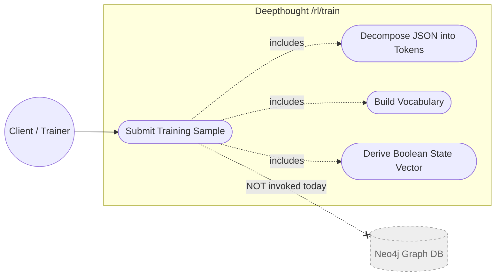
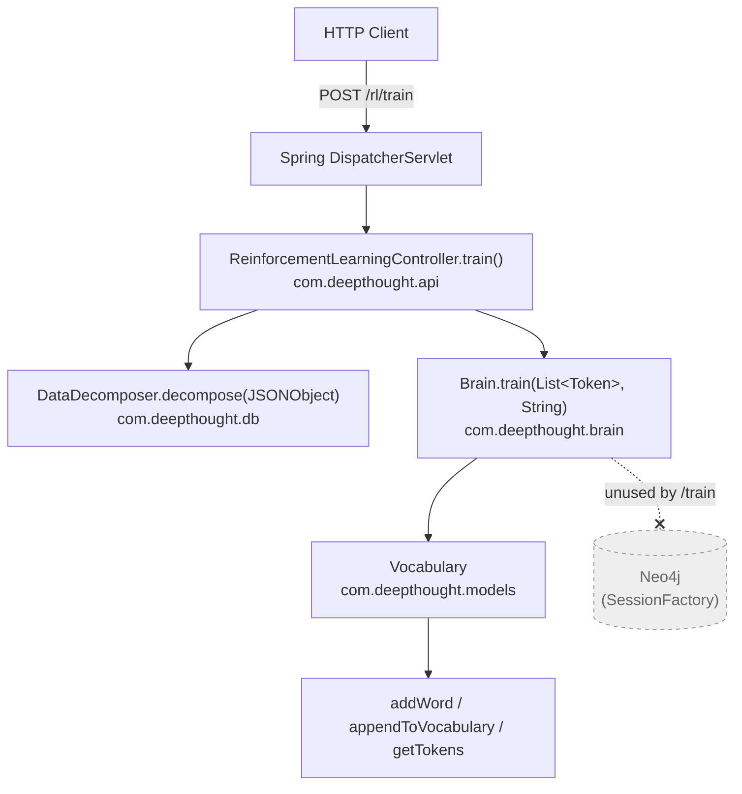
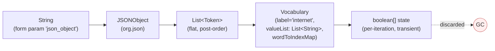
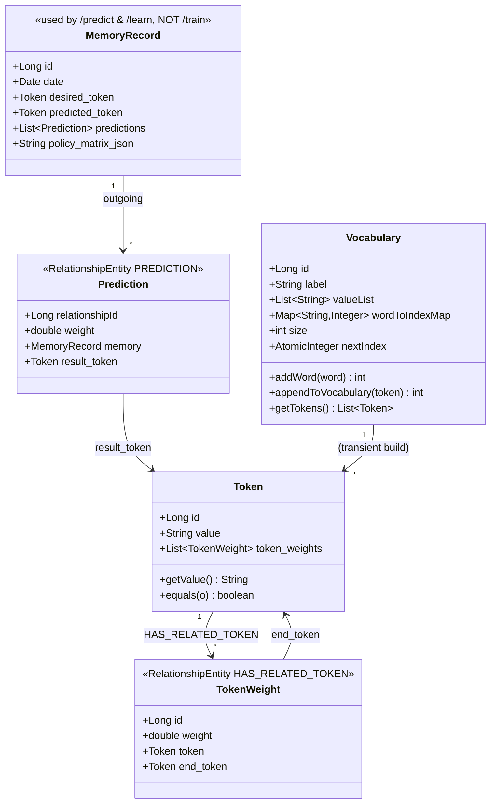
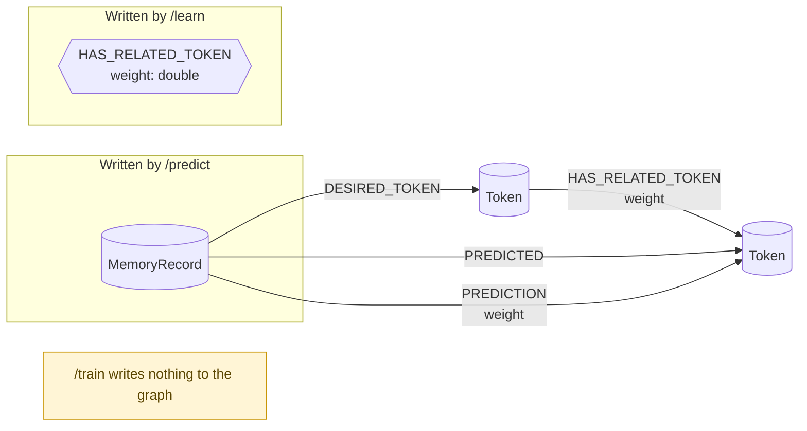

# `/rl/train` Endpoint — Architecture & Process Reference

> Authoritative walkthrough of what happens when a client calls `POST /rl/train` in the Deepthought reasoning engine.
>
> **Audience:** Engineers extending or debugging the reinforcement-learning controller, the `Brain`, or the JSON decomposition pipeline.

---

## 1. Overview

The `/rl/train` endpoint accepts an arbitrary JSON object plus a class label and is intended to drive the supervised side of Deepthought's reinforcement-learning loop. Internally it performs three operations:

1. **Decompose** the supplied JSON into a flat `List<Token>` via `DataDecomposer.decompose(...)`.
2. **Build a vocabulary** from those tokens by appending each one to a fresh `Vocabulary` instance.
3. **Derive a per-token boolean state vector** describing which vocabulary words are present in the sample.

| Property | Value |
|----------|-------|
| HTTP Method | `POST` |
| Path | `/rl/train` |
| Encoding | `application/x-www-form-urlencoded` (form params) |
| Auth | None |
| Response | `200 OK`, empty body (`void`) |
| Side effects (today) | Log lines only — see §10 |

> **Heads-up:** despite the name, the `/train` implementation today does **not** persist any state to Neo4j and **does not** update edge weights. See **§10 Current-State Observations & Gaps** before relying on it.

---

## 2. API Contract

### Request

```
POST /rl/train HTTP/1.1
Content-Type: application/x-www-form-urlencoded

json_object={...}&label=GREETING
```

| Parameter | Required | Type | Description |
|-----------|----------|------|-------------|
| `json_object` | yes | `String` | A JSON document describing the training sample. May be nested objects, arrays, or primitives. |
| `label` | yes | `String` | The intended class label for the sample. *(Currently unused inside `Brain.train()`; see §10.)* |

### Response

- `200 OK` with empty body on success.
- Spring's default error mapping is used for thrown exceptions:

| Exception | Typical cause | Default mapping |
|-----------|---------------|-----------------|
| `JSONException` | `json_object` is not valid JSON | `400 Bad Request` |
| `IllegalArgumentException` | Reflection/decomposition rejects an input | `400 Bad Request` |
| `IllegalAccessException` | Reflection cannot read a field | `500 Internal Server Error` |
| `NullPointerException` | Missing/null fields during decomposition | `500 Internal Server Error` |
| `IOException` | Propagated I/O failure | `500 Internal Server Error` |

### Example

```bash
curl -X POST http://localhost:8080/rl/train \
  -d 'json_object={"sentence":"hello world"}' \
  --data-urlencode 'label=GREETING'
```

Expected log output:

```
INFO  Brain -  Initiating learning
INFO  Brain - object definition list size :: 2
INFO  Brain - vocabulary :: ...
INFO  Brain - vocab value list size   :: 2
```

---

## 3. Use Case Diagram



The dashed line to Neo4j highlights that, while the broader system is graph-backed, `/train` itself currently issues no Cypher queries. Compare with `/predict` and `/learn`, which both read and write the graph.

---

## 4. Component / Architecture Diagram



Spring component-scans both `com.deepthought` and `com.qanairy` (see `App.java`). The `Brain` bean is field-injected into the controller via `@Autowired`.

---

## 5. Sequence Diagram

```mermaid
sequenceDiagram
    autonumber
    participant Client
    participant Spring as DispatcherServlet
    participant Ctrl as ReinforcementLearningController
    participant Dec as DataDecomposer
    participant Brain as Brain
    participant Vocab as Vocabulary

    Client->>Spring: POST /rl/train (json_object, label)
    Spring->>Ctrl: train(json_object, label)
    Ctrl->>Ctrl: new JSONObject(json_object)
    Ctrl->>Dec: decompose(json_obj)
    activate Dec
    loop for each key in JSON
        Dec->>Dec: classify value & recurse
        Note right of Dec: nested JSONObject → recurse<br/>JSONArray → recurse<br/>String → split on whitespace<br/>→ new Token(word)
    end
    Dec-->>Ctrl: List&lt;Token&gt; token_list
    deactivate Dec

    Ctrl->>Brain: train(token_list, label)
    activate Brain
    Brain->>Vocab: new Vocabulary([], "internet")
    Note right of Brain: NOTE: hard-coded label;<br/>caller's `label` is ignored
    loop for each Token in token_list
        Brain->>Vocab: appendToVocabulary(token)
        Vocab->>Vocab: addWord(value.toLowerCase())
    end
    Brain->>Vocab: getTokens()
    Vocab-->>Brain: List&lt;Token&gt;
    loop for each vocab token
        Brain->>Brain: boolean[] state = new boolean[size]<br/>state[idx] = token_list.contains(t)
        Note right of Brain: state array is local to<br/>the loop iteration and<br/>is discarded
    end
    Brain-->>Ctrl: void
    deactivate Brain

    Ctrl-->>Spring: void
    Spring-->>Client: 200 OK (empty body)
```

---

## 6. Step-by-Step Procedure

Every step below is line-cited against the current source tree.

### 6.1 Controller entry — `ReinforcementLearningController.train(...)`

**File:** `src/main/java/com/deepthought/api/ReinforcementLearningController.java:224-234`

```java
@RequestMapping(value ="/train", method = RequestMethod.POST)
public  @ResponseBody void train(@RequestParam(value="json_object", required=true) String json_object,
                                 @RequestParam String label)
        throws JSONException, IllegalArgumentException, IllegalAccessException,
               NullPointerException, IOException
{
    JSONObject json_obj = new JSONObject(json_object);          // line 231
    List<Token> token_list = DataDecomposer.decompose(json_obj); // line 232
    brain.train(token_list, label);                              // line 233
}
```

1. Spring binds the form parameters `json_object` and `label`.
2. The raw JSON string is parsed into a `org.json.JSONObject`. A malformed payload raises `JSONException`.
3. The parsed object is fed into the static `DataDecomposer.decompose(JSONObject)` (next step).
4. The resulting `List<Token>` is forwarded — together with the user-supplied `label` — to `brain.train(...)`.
5. The method returns `void`; Spring writes a `200 OK` with no body.

### 6.2 JSON decomposition — `DataDecomposer.decompose(JSONObject)`

**File:** `src/main/java/com/deepthought/db/DataDecomposer.java:31-101`

The decomposer walks the JSON recursively and emits a flat `List<Token>` whose order is the post-order traversal of leaf values.

| Source range | Branch | Behavior |
|--------------|--------|----------|
| `:34-39` | iterate keys | Loops over `jsonObject.keys()` and dispatches per value type |
| `:44-50` | nested `JSONObject` | Recurses with `decompose(obj)` and concatenates the result |
| `:51-57` | `ArrayList` | Delegates to `decomposeArrayList(...)` (`:284-296`) |
| `:62-70` | `String[]` | Each element becomes a `new Token(word)` |
| `:71-77` | `Object[]` | Delegates to `decomposeObjectArray(...)` (`:264-274`) |
| `:78-84` | `JSONArray` | For each element, recurses into `decompose(...)` |
| `:85-92` | string scalar | `value.toString().split("\\s+")` and emits `new Token(word)` per token |

Key invariant: every leaf string value is **whitespace-tokenized**, so `"hello world"` produces two `Token`s rather than one.

### 6.3 Hand-off into the brain — `Brain.train(...)`

**File:** `src/main/java/com/deepthought/brain/Brain.java:254-282`

```java
public void train(List<Token> token_list, String label) {
    log.info(" Initiating learning");

    // 1. identify vocabulary (NOTE: This is currently hard coded ...)
    Vocabulary vocabulary = new Vocabulary(new ArrayList<Token>(), "internet");  // line 260

    log.info("object definition list size :: " + token_list.size());
    // 2. create record based on vocabulary
    for (Token token : token_list) {
        vocabulary.appendToVocabulary(token);                                    // line 265
    }

    log.info("vocabulary :: " + vocabulary);
    log.info("vocab value list size   :: " + vocabulary.getTokens().size());

    // 2. create state vertex from vocabulary
    int idx = 0;
    for (Token vocab_token : vocabulary.getTokens()) {
        boolean[] state = new boolean[vocabulary.getTokens().size()];           // line 273
        if (token_list.contains(vocab_token)) {
            state[idx] = true;
        } else {
            state[idx] = false;
        }
        idx++;
    }
}
```

Three sub-procedures:

**A. Vocabulary construction (lines 260, 264-266)**
- A *new* `Vocabulary` is instantiated for every request; nothing is loaded from Neo4j.
- The label is hard-coded to `"internet"`. The `label` argument received from the HTTP layer is discarded.
- Each token is appended via `Vocabulary.appendToVocabulary(token)` (`Vocabulary.java:126-131`), which calls `addWord(token.getValue())` (`Vocabulary.java:101-118`).
- `addWord` lowercases the word, deduplicates against the existing `valueList`, appends if new, and returns the resulting index.

**B. Diagnostic logging (lines 256, 262, 268-269)**
- These are the only externally observable effects of `/train` today.

**C. State-vector loop (lines 271-281)**
- For each unique vocabulary token, a fresh `boolean[]` of length `vocabulary.size()` is allocated *inside* the loop body (line 273).
- Exactly one slot — `state[idx]` — is set to reflect whether the token appears in the original `token_list`.
- The reference to `state` is never captured outside the loop; the array is garbage-collected after each iteration. Effectively, **this loop has no side effects beyond the running `idx` counter**. (See §10.)

### 6.4 Return path

- `Brain.train(...)` returns `void`.
- The controller method returns `void`.
- Spring serializes nothing and writes the HTTP `200 OK` response.

---

## 7. Data-Flow Diagram



---

## 8. Domain Model Diagram



For `/train` only `Token` and `Vocabulary` are instantiated — and neither is persisted. `TokenWeight`, `MemoryRecord`, and `Prediction` are shown for context because they are the targets `/learn` writes to.

---

## 9. Neo4j Graph Schema



---

## 10. Current-State Observations & Gaps

This section documents how the implementation **diverges from the endpoint's apparent intent**. These are not necessarily bugs to be fixed in this document — they are facts a reader must know.

### 10.1 The `label` parameter is ignored

`Brain.train()` always constructs the vocabulary with the literal string `"internet"`:

```java
// Brain.java:260
Vocabulary vocabulary = new Vocabulary(new ArrayList<Token>(), "internet");
```

The `label` argument received from the HTTP layer is never read. From the caller's perspective, `label=GREETING` and `label=SHOPPING_CART` produce identical behavior.

### 10.2 No persistence

`Brain.train()` performs zero repository calls. The `Vocabulary` instance, the `Token` list, and the per-iteration `state` arrays are all local objects that go out of scope when the method returns. **No node is created and no edge weight is changed by `/train`.**

Compare with `Brain.learn()` (`Brain.java:75-149`), which invokes `QLearn.calculate(...)` and writes new `TokenWeight` values via `TokenRepository.createWeightedConnection(...)`.

### 10.3 The state-vector loop appears incomplete

```java
// Brain.java:271-281
int idx = 0;
for (Token vocab_token : vocabulary.getTokens()) {
    boolean[] state = new boolean[vocabulary.getTokens().size()];  // re-allocated every iteration
    if (token_list.contains(vocab_token)) {
        state[idx] = true;
    } else {
        state[idx] = false;
    }
    idx++;
}
```

- The `state` array is allocated fresh inside the loop body, so each iteration produces a new array.
- Only `state[idx]` is ever written before `state` is overwritten on the next iteration.
- The reference is never captured (no `List`, no field assignment, no return), so every array is immediately eligible for GC.
- Net effect: the loop only mutates the running `idx` counter, which is itself unused after the loop.

A reasonable interpretation is that the loop is half-finished scaffolding for a future feature (likely "build a single state vector across the vocabulary"). It currently does no useful work.

### 10.4 Observable side effects

The only externally visible effects of a `/train` call are the four `log.info(...)` lines inside `Brain.train()`:

| Line | Message |
|------|---------|
| `Brain.java:256` | ` Initiating learning` |
| `Brain.java:262` | `object definition list size :: <n>` |
| `Brain.java:268` | `vocabulary :: <Vocabulary.toString()>` |
| `Brain.java:269` | `vocab value list size   :: <n>` |

If you do not see these lines, the request never reached `Brain.train()`.

### 10.5 Implications for callers

- Calling `/train` repeatedly does **not** improve subsequent `/predict` results.
- Calling `/train` does **not** seed the graph with vocabulary or tokens.
- Treat `/train` as a no-op pipeline today and prefer `/predict` + `/learn` for any actual learning.

---

## 11. Dependencies & Configuration

### Spring wiring

- Component scan covers `com.deepthought` and `com.qanairy` — declared on the `App` class via `@ComponentScan(basePackages = {"com.deepthought","com.qanairy"})`.
- `Brain` is a Spring-managed bean field-injected into `ReinforcementLearningController` with `@Autowired`.

### Neo4j

- Configuration class: `src/main/java/com/deepthought/config/Neo4jConfiguration.java`.
- Connection settings live in `src/main/resources/application.properties`:

  ```properties
  #spring.data.neo4j.uri= << bolt uri >>
  #spring.data.neo4j.username= <<username>>
  #spring.data.neo4j.password= <<password>>
  ```

  These are commented out by default — fill them in before starting the app. The `/train` endpoint itself does not touch Neo4j, but the application context will fail to start without a reachable database.

### Notable third-party libraries

| Library | Used by `/train`? | Purpose |
|---------|-------------------|---------|
| `org.json:json` | yes | Parses `json_object` form parameter |
| Neo4j OGM / Spring Data Neo4j | no (not on this path) | Graph persistence for `/predict` & `/learn` |
| SLF4J / Logback | yes | The four `log.info` lines |

---

## 12. Testing

### Existing coverage

- **Unit test:** `src/test/java/com/qanairy/api/ReinforcementLearningControllerTests.java:113-118`

  ```java
  @Test
  public void train_decomposesJsonAndDelegatesToBrain() throws Exception {
      controller.train("{\"sentence\":\"hello world\"}", "GREETING");
      verify(brain).train(any(), eq("GREETING"));
  }
  ```

  Mocks `Brain` and only asserts that the controller forwards to `brain.train(...)` with the supplied label. It does **not** exercise `Brain.train()`, `Vocabulary`, or any persistence.

- **Adjacent tests:**
  - `BrainTests.java` covers `predict()` and `loadVocabularies()` only.
  - `DataDecomposerTests.java` covers the four `decompose*` overloads.

There is no integration test for `/train`.

### Suggested manual verification

1. Boot the app: `mvn spring-boot:run` (Neo4j must be reachable, even though `/train` itself does not query it).
2. Issue a request:

   ```bash
   curl -X POST http://localhost:8080/rl/train \
     -d 'json_object={"sentence":"hello world"}' \
     --data-urlencode 'label=GREETING'
   ```

3. Confirm the response is `200 OK` with an empty body.
4. Confirm the four `Brain` log lines appear in the application log.
5. Confirm via `cypher-shell` that **no new nodes/edges** were created (this is the documented current behavior — see §10.2).

### Suggested automated verification

```bash
mvn test -Dtest=ReinforcementLearningControllerTests
mvn test -Dtest=DataDecomposerTests
```

Both must pass for the documented behavior to hold.

---

## 13. File Reference Index

| Concern | File | Lines |
|---------|------|-------|
| Controller method | `src/main/java/com/deepthought/api/ReinforcementLearningController.java` | 224-234 |
| JSON decomposer (root) | `src/main/java/com/deepthought/db/DataDecomposer.java` | 31-101 |
| Decomposer — ArrayList branch | `src/main/java/com/deepthought/db/DataDecomposer.java` | 284-296 |
| Decomposer — Object[] branch | `src/main/java/com/deepthought/db/DataDecomposer.java` | 264-274 |
| `Brain.train` | `src/main/java/com/deepthought/brain/Brain.java` | 254-282 |
| `Vocabulary` constructor | `src/main/java/com/deepthought/models/Vocabulary.java` | 86-93 |
| `Vocabulary.addWord` | `src/main/java/com/deepthought/models/Vocabulary.java` | 101-118 |
| `Vocabulary.appendToVocabulary` | `src/main/java/com/deepthought/models/Vocabulary.java` | 126-131 |
| `Vocabulary.getTokens` | `src/main/java/com/deepthought/models/Vocabulary.java` | 195-201 |
| `Token` entity | `src/main/java/com/deepthought/models/Token.java` | — |
| `TokenWeight` edge (context) | `src/main/java/com/deepthought/models/edges/TokenWeight.java` | — |
| Neo4j configuration (context) | `src/main/java/com/deepthought/config/Neo4jConfiguration.java` | — |
| Existing unit test | `src/test/java/com/qanairy/api/ReinforcementLearningControllerTests.java` | 113-118 |
