# Deepthought — System Architecture

> Authoritative high-level architecture reference. Covers all four HTTP
> subsystems (`/rl`, `/llm`, `/lr`, `/images`), the Neo4j-backed data plane,
> the deployment topology, and the cross-cutting use cases.
>
> For per-endpoint deep dives see
> [`PREDICT_ENDPOINT.md`](./PREDICT_ENDPOINT.md),
> [`LEARN_ENDPOINT.md`](./LEARN_ENDPOINT.md), and
> [`TRAIN_ENDPOINT.md`](./TRAIN_ENDPOINT.md).
> For the data layer see [`DATA_MODEL.md`](./DATA_MODEL.md).
> For internal algorithms see [`BRAIN_SUBSYSTEM.md`](./BRAIN_SUBSYSTEM.md).

---

## 1. What Deepthought Is

Deepthought is a graph-backed reasoning engine. The same Neo4j graph plays
three roles depending on which controller is reading from it:

| Role | Read by | What the graph "is" |
|------|---------|---------------------|
| **Q-learning policy store** | `/rl/*` | `(:Token)-[:HAS_RELATED_TOKEN {weight}]->(:Token)` edges form a sparse policy matrix |
| **Bigram language model** | `/llm/*` | The same edges, normalized per source token, become a next-token probability distribution |
| **Image structure graph** | `/images/*` | `(:ImageMatrixNode)-[:PART_OF]->(:ImageMatrixNode)` links derived matrices to their original |

A separate persistence pathway stores serialized Tribuo logistic-regression
models as `(:LogisticRegressionModel)` nodes, used by `/lr/*`.

The application is a single Spring Boot process. There are no internal
services, message buses, or worker pools — the only external dependency is
Neo4j over Bolt.

### 1.1 Design philosophy

- **The graph is the model.** Weights are not in a tensor file; they are
  edge properties. Any read of `HAS_RELATED_TOKEN.weight` sees the latest
  learned value.
- **Interpretability over raw performance.** Predictions are
  column-sum-then-normalize over a sparse matrix; every learned parameter
  has a name (`source.value → target.value`) and a queryable provenance
  via `MemoryRecord`.
- **No GPU, no model server.** The "model" lives in Neo4j; the JVM is the
  inference runtime.

---

## 2. C4 Context — what talks to what

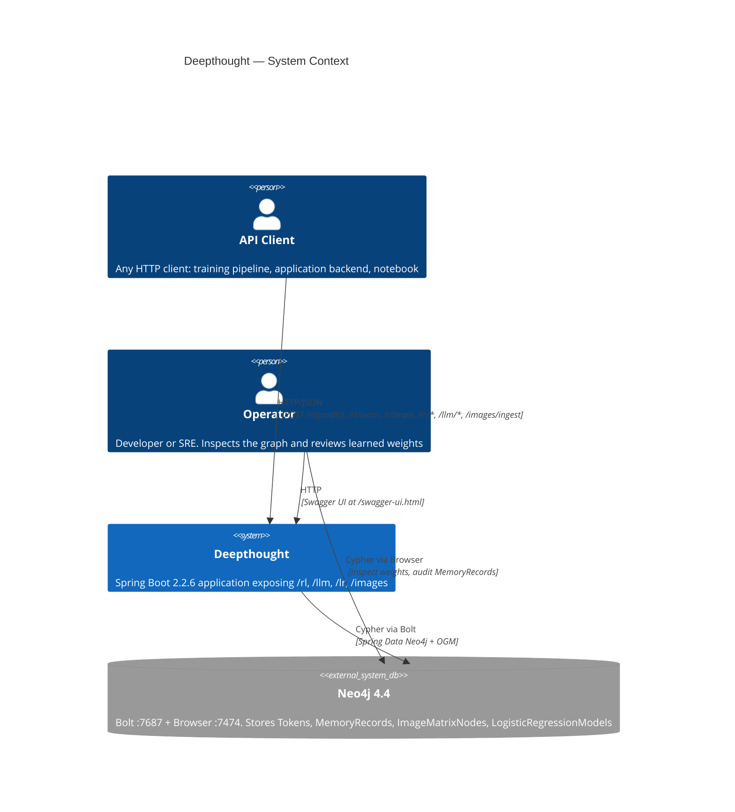

---

## 3. C4 Container — process boundaries

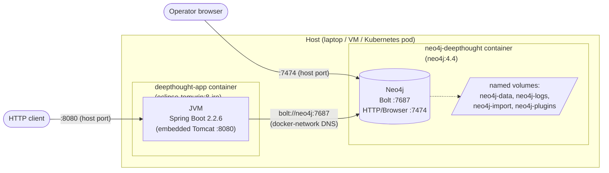

Sources:
- `Dockerfile`
- `docker-compose.yml`
- `src/main/java/com/deepthought/config/Neo4jConfiguration.java`

---

## 4. C4 Component — inside the JVM

```mermaid
flowchart TB
    subgraph http["HTTP layer (REST controllers)"]
        RL["ReinforcementLearningController<br/>/rl/predict, /rl/learn, /rl/train"]
        LM["LanguageModelController<br/>/llm/distribution, /llm/predict-next, /llm/generate"]
        LR["LogisticRegressionController<br/>/lr/train, /lr/predict,<br/>/lr/train-from-tokens, /lr/predict-from-tokens"]
        IMG["ImageIngestionController<br/>/images/ingest"]
    end

    subgraph svc["Service / brain layer"]
        Brain["Brain<br/>generatePolicy, predict, learn, train"]
        QL["QLearn<br/>pure Q-update"]
        LMS["LanguageModelService<br/>nextTokenDistribution,<br/>predictNext, generate"]
        LRS["LogisticRegressionService<br/>Tribuo LinearSGDTrainer"]
        IPS["ImageProcessingService<br/>OpenCV + Commons Math3"]
        DD["DataDecomposer<br/>JSON → List&lt;Token&gt;"]
        TV["TokenVector<br/>elastic vector helper"]
        TS["TokenService<br/>read-only Token lookups"]
    end

    subgraph data["Spring Data Neo4j repositories"]
        TR["TokenRepository<br/>findByValue,<br/>getConnectedTokens,<br/>createWeightedConnection"]
        TWR["TokenWeightRepository"]
        MR["MemoryRecordRepository"]
        PR["PredictionRepository"]
        VR["VocabularyRepository"]
        IMR["ImageMatrixNodeRepository"]
        POR["PartOfRepository"]
        LRR["LogisticRegressionModelRepository"]
    end

    subgraph cfg["Configuration"]
        N4C["Neo4jConfiguration<br/>SessionFactory,<br/>Neo4jTransactionManager"]
        CS["ConfigService<br/>env-var loader"]
    end

    Neo[("Neo4j 4.4<br/>via Bolt")]

    RL --> Brain
    RL --> DD
    RL --> TR
    RL --> MR
    RL --> PR

    LM --> LMS
    LMS --> TR

    LR --> LRS
    LR --> LRR
    LRS --> DD
    LRS --> LRR

    IMG --> IPS
    IMG --> IMR
    IMG --> POR

    Brain --> QL
    Brain --> TR
    Brain --> TWR
    Brain --> MR
    Brain --> TV

    TR -.-> Neo
    TWR -.-> Neo
    MR -.-> Neo
    PR -.-> Neo
    VR -.-> Neo
    IMR -.-> Neo
    POR -.-> Neo
    LRR -.-> Neo

    N4C -. SessionFactory bean .-> TR
    CS -. env vars .-> N4C
```

### 4.1 Package vs. directory note

The codebase has a long-standing split between the on-disk path and the
package declaration. This is benign at runtime because
`App.java` declares
`@ComponentScan(basePackages = {"com.deepthought","com.qanairy"})`.

| Class | `package` declaration | Filesystem path |
|---|---|---|
| `App` | `com.qanairy.deepthought` | `src/main/java/com/deepthought/deepthought/App.java` |
| `ReinforcementLearningController` | `com.qanairy.api` | `src/main/java/com/deepthought/api/ReinforcementLearningController.java` |
| `LanguageModelController` | `com.qanairy.api` | `src/main/java/com/deepthought/api/LanguageModelController.java` |
| `LogisticRegressionController` | `com.qanairy.api` | `src/main/java/com/deepthought/api/LogisticRegressionController.java` |
| `ImageIngestionController` | `com.qanairy.api` | `src/main/java/com/qanairy/api/ImageIngestionController.java` |
| `Brain`, `QLearn`, `TokenVector`, `LanguageModelService`, `LogisticRegressionService` | `com.qanairy.brain` | `src/main/java/com/deepthought/brain/*.java` |
| `DataDecomposer`, `VocabularyWeights` | `com.qanairy.db` | `src/main/java/com/deepthought/db/*.java` |
| `ImageProcessingService` | `com.qanairy.image` | `src/main/java/com/qanairy/image/ImageProcessingService.java` |
| `Token`, `Vocabulary`, `MemoryRecord`, `ImageMatrixNode`, `LogisticRegressionModel`, edges, repositories | `com.deepthought.models.*` | `src/main/java/com/deepthought/models/...` |
| `Neo4jConfiguration`, `ConfigService` | `com.deepthought.config` | `src/main/java/com/deepthought/config/*.java` |
| `ObservableHash`, `ObservableQueue`, `ConcurrentNode` | `com.qanairy.observableStructs` | `src/main/java/com/deepthought/observableStructs/*.java` |

When searching code use the package declaration; when navigating the
working tree use the filesystem path.

---

## 5. HTTP API Surface

| Subsystem | Method | Path | Purpose | Touches Neo4j? |
|---|---|---|---|---|
| RL | `POST` | `/rl/predict` | Score candidate tokens; persist `MemoryRecord` + `PREDICTION` edges; cold-start materializes `HAS_RELATED_TOKEN` edges | read + write |
| RL | `POST` | `/rl/learn` | Apply Q-learning update to `HAS_RELATED_TOKEN` weights tied to a prior `MemoryRecord` | read + write |
| RL | `POST` | `/rl/train` | Decompose JSON, build in-memory `Vocabulary`. **Today writes nothing.** | no |
| LLM | `GET`  | `/llm/distribution` | Normalize outgoing `HAS_RELATED_TOKEN` weights of a seed token | read |
| LLM | `POST` | `/llm/predict-next` | Greedy argmax over the distribution above | read |
| LLM | `POST` | `/llm/generate` | Walk the graph greedily or stochastically up to `max_length` (cap 1000) | read |
| LR  | `POST` | `/lr/train` | Train Tribuo `LinearSGDTrainer` on a `double[][]` feature matrix; persist `LogisticRegressionModel` | write |
| LR  | `POST` | `/lr/predict` | Score one `double[]` against a stored model | read |
| LR  | `POST` | `/lr/train-from-tokens` | Decompose JSON/text inputs, one-hot against learned vocabulary, train | write |
| LR  | `POST` | `/lr/predict-from-tokens` | Decompose, one-hot against model's stored vocabulary, score | read |
| Image | `POST` | `/images/ingest` | Decode base64 image; create `ORIGINAL` + `OUTLINE` + `PCA` + `BLACK_WHITE` + `CROPPED_OBJECT` matrix nodes linked via `PART_OF` | write |

The OpenAPI 3 spec at [`openapi.yaml`](../openapi.yaml) is the contract
source; Swagger UI is exposed at `/swagger-ui.html` when the app is
running.

### 5.1 What is *not* exposed

The README historically advertised an `/api/v2/*` reasoning surface
(`EnhancedReasoningController`, chat/explain/knowledge endpoints). **None
of those exist in the source today** — only the four subsystems in the
table above are implemented. This gap is tracked in
[`CODE_REVIEW_PLAN.md`](./CODE_REVIEW_PLAN.md) §1.

---

## 6. Request lifecycle — generic flow

Every request follows the same Spring Boot pipeline before fanning out
into a subsystem-specific handler.

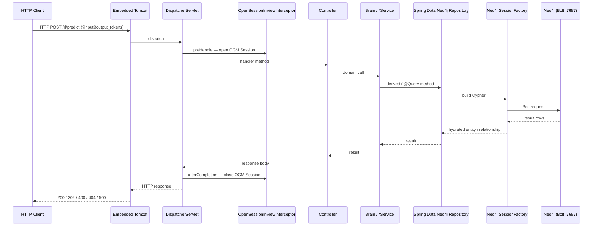

Notes:

- `OpenSessionInViewInterceptor` is wired up in
  `Neo4jConfiguration.java` so lazy-loaded relationships on entities can
  still be traversed in the controller after the repository call returns.
- Each repository call gets its own Bolt round-trip — there is no
  batching layer. `/rl/predict` and `/rl/learn` are deliberately
  per-cell, so an N×M cold-start prediction does N·M round trips. This
  is the dominant bottleneck for cold inputs.

---

## 7. Subsystem narratives

For each subsystem this section describes **the goal, the inputs, the
graph effect, and the engineering caveats**. Endpoint-level detail lives
in the per-endpoint docs.

### 7.1 Reinforcement Learning (`/rl/*`)

Token weights are the parameters. A prediction is built by reading the
matrix of weights connecting input tokens to candidate output tokens,
column-summing, and normalizing.

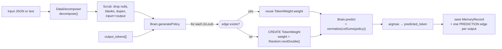

- Cold start writes happen *during predict*. The first prediction over a
  novel `(input, output)` pair generates a uniform random weight in
  `[0, 1)` and persists it.
- Learning is localized: `/rl/learn` updates only `HAS_RELATED_TOKEN`
  edges from the `MemoryRecord`'s input keys to its output keys. The
  graph elsewhere is untouched.
- The Q-update is the textbook form
  `Q' = Q + α·(R + γ·Q_future)` with `α=γ=0.1`, `Q_future` hard-coded
  to `1.0`. See [`LEARN_ENDPOINT.md`](./LEARN_ENDPOINT.md) §6 for the
  full reward table and the `Math.abs` caveat.

### 7.2 Language Model (`/llm/*`)

The bigram language model is a *view* over the same edges that the RL
subsystem learns into. Nothing extra is persisted; weight updates from
`/rl/learn` show up immediately in the next `/llm/*` call.

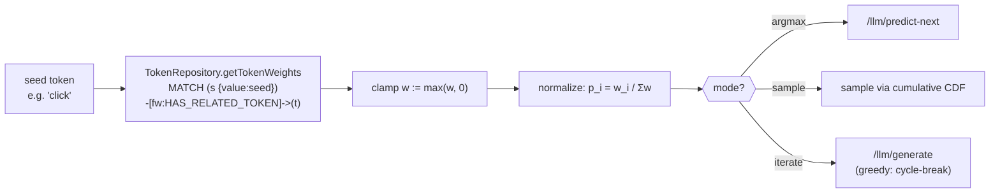

- `MAX_GENERATION_LENGTH = 1000` is enforced by
  `LanguageModelService.generate`. Larger requests raise
  `IllegalArgumentException` → 400.
- Greedy generation breaks on revisit; stochastic generation does not.

### 7.3 Logistic Regression (`/lr/*`)

A second model family, completely independent from the Token graph. Each
trained model is a Neo4j node carrying a serialized Tribuo
`Model<Label>`.

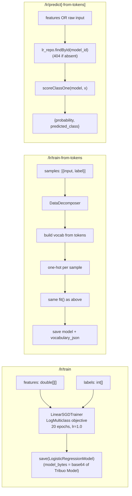

- Validation: feature row count must match label length, ≥2 samples,
  both classes present, feature dimensionality must match the stored
  `num_features` at inference. All raise `IllegalArgumentException`
  → 400 via the controller's `@ExceptionHandler`.
- Persistence model: the Tribuo `Model<Label>` is Java-serialized to a
  byte array, Base64-encoded, and stored on the `model_bytes` property
  of the `LogisticRegressionModel` node. The vocabulary (for
  token-based models) is Gson-serialized to `vocabulary_json`.

### 7.4 Image Ingestion (`/images/*`)

A purely write-side pipeline that turns one base64 image into 4 + N
nodes, where N is the number of object contours detected.

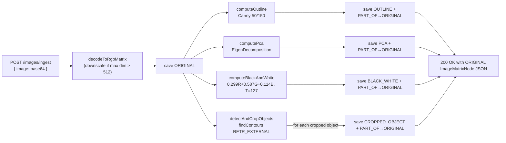

- OpenCV native libraries are loaded via the JavaCPP `org.openpnp:opencv`
  artifact; the Dockerfile uses the Debian-based
  `eclipse-temurin:8-jre` runtime so `glibc` / `libstdc++` are available.
  An Alpine base would break the native image-codec path.
- `IMG max dimension = 512` (in `ImageProcessingService`). Larger images
  are downscaled before processing.
- Errors map to: 400 for empty/invalid base64; 500 for I/O or processing
  failures.

---

## 8. Networking & Deployment Topology

### 8.1 docker-compose topology (the supported deployment)

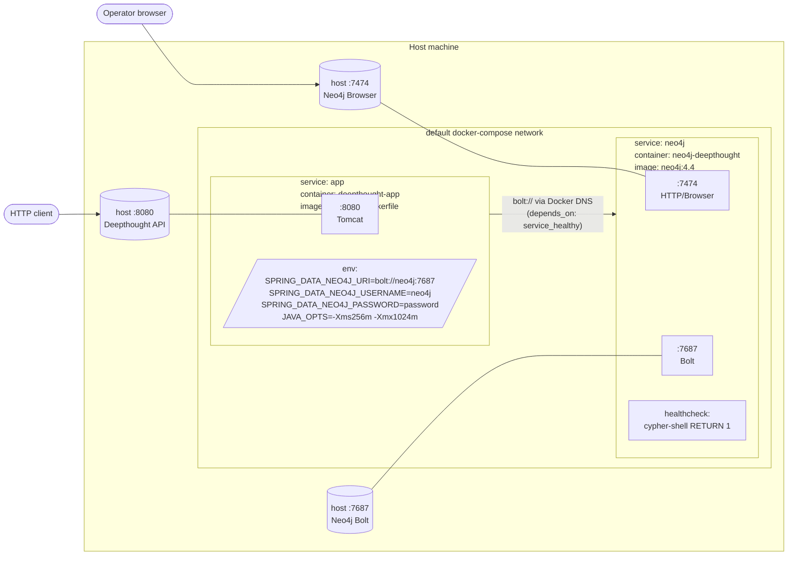

Sources: [`docker-compose.yml`](../docker-compose.yml),
[`Dockerfile`](../Dockerfile).

| Concern | Setting | Source |
|---|---|---|
| App image | Multi-stage: `maven:3.9.10-eclipse-temurin-8` → `eclipse-temurin:8-jre` | `Dockerfile` |
| Runtime user | `appuser:appgroup` (uid/gid 9999), non-root | `Dockerfile` |
| Exposed app port | `EXPOSE 8080`; published `8080:8080` | `Dockerfile`, `docker-compose.yml` |
| JVM tuning hook | `JAVA_OPTS` env, default empty in image, set to `-Xms256m -Xmx1024m` in compose | `Dockerfile`, `docker-compose.yml` |
| Neo4j image | `neo4j:4.4` | `docker-compose.yml` |
| Neo4j ports | `7474:7474` (Browser/HTTP), `7687:7687` (Bolt) | `docker-compose.yml` |
| Neo4j auth | `NEO4J_AUTH=neo4j/password` | `docker-compose.yml` |
| Neo4j memory | heap 512m, page cache 256m | `docker-compose.yml` |
| Persistence | Named volumes `neo4j-data`, `neo4j-logs`, `neo4j-import`, `neo4j-plugins` | `docker-compose.yml` |
| Health gate | App `depends_on.neo4j.condition: service_healthy`; Neo4j healthcheck via `cypher-shell` | `docker-compose.yml` |
| Restart policy | `unless-stopped` (both services) | `docker-compose.yml` |

### 8.2 Application configuration

`application.properties` is templated; the active settings come from
environment variables in the docker-compose deployment and are resolved
either by Spring Boot's relaxed binding (`SPRING_DATA_NEO4J_URI` →
`spring.data.neo4j.uri`) or by `ConfigService.getEnvVar(...)` for
Neo4j credentials in `Neo4jConfiguration`. Running outside Docker
requires either uncommenting and editing
`src/main/resources/application.properties` or exporting the same
environment variables before `mvn spring-boot:run`.

### 8.3 Direct-Maven topology (local development)

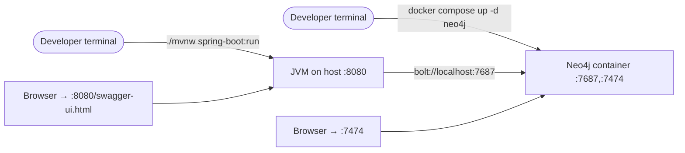

This is the workflow recommended in
[`PREDICT_ENDPOINT.md`](./PREDICT_ENDPOINT.md) §7 and
[`LEARN_ENDPOINT.md`](./LEARN_ENDPOINT.md) §11.

### 8.4 Trust boundaries

| Boundary | What crosses it | Authentication today |
|---|---|---|
| HTTP client → app (`:8080`) | All endpoint traffic, including raw JSON payloads and base64 images | **None.** No `SecurityFilterChain` is configured. Anyone with network reach to `:8080` can read or mutate the graph. |
| App → Neo4j (`bolt://neo4j:7687`) | Cypher | Username/password (`neo4j` / `password` in compose). Plaintext over Bolt; no TLS configured. |
| Operator → Neo4j Browser (`:7474`) | Cypher | Username/password. |

This is the documented dev posture. Any production deployment needs at
least: HTTPS termination, an auth layer (Spring Security or a sidecar
gateway), and Neo4j Bolt+TLS or a private network.

---

## 9. Use-Case Diagrams

The per-endpoint docs each carry their own use-case diagram. This
section is the cross-cutting view: what *workflows* the system supports
end-to-end.

### 9.1 Reinforcement-learning training loop

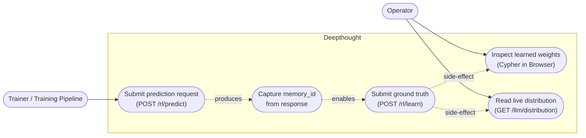

Cold-start observation: the *first* `/rl/predict` over a novel
input/output pair persists random weights. The same call therefore both
queries the model and writes to it.

### 9.2 Supervised classification

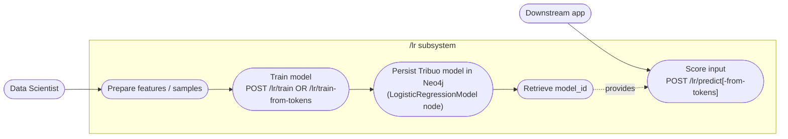

### 9.3 Language-model generation

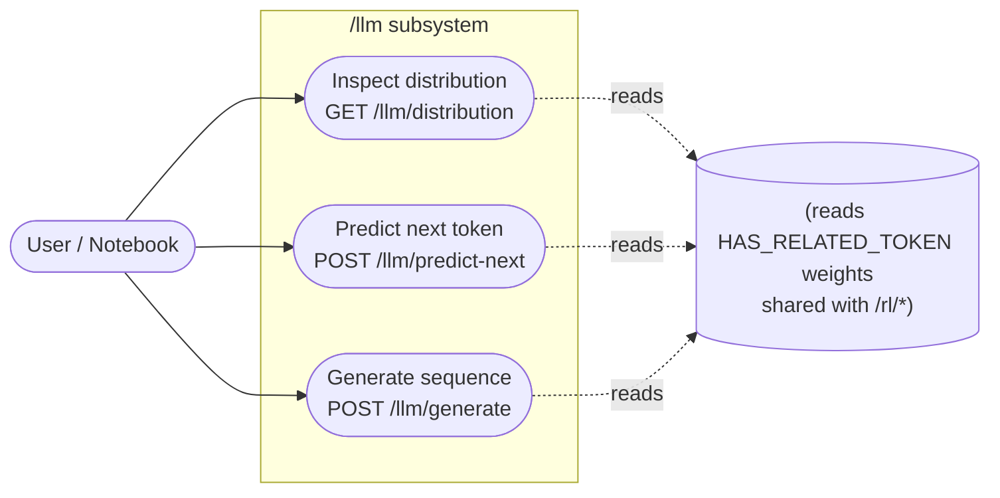

### 9.4 Image ingestion

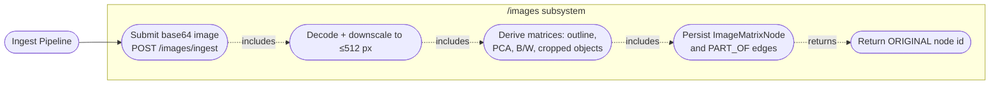

### 9.5 Actor / use-case crosswalk

| Actor | Reads weights | Writes weights | Trains LR | Ingests images |
|---|:---:|:---:|:---:|:---:|
| Training pipeline | ✓ (`/rl/predict`) | ✓ (`/rl/predict` cold-start, `/rl/learn`) | ✓ | — |
| Downstream application | ✓ (`/rl/predict`, `/llm/*`, `/lr/predict*`) | ✓ (`/rl/predict` cold-start) | — | — |
| Data scientist | ✓ (Browser) | — | ✓ | — |
| Image ingest pipeline | — | — | — | ✓ |
| Operator / SRE | ✓ (Browser, Swagger) | manual | manual | manual |

---

## 10. Data Plane Overview

Full schema lives in [`DATA_MODEL.md`](./DATA_MODEL.md). The summary
view here is the minimum needed to reason about the architecture.

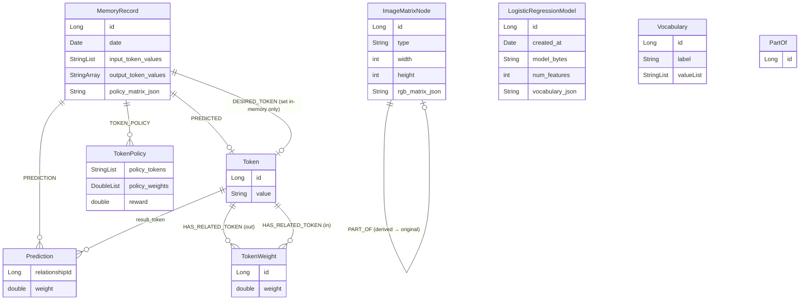

Notes:

- `DESIRED_TOKEN` is set on the in-memory `MemoryRecord` by
  `Brain.learn` but **never persisted** (no `memory_repo.save` follows
  the mutation). It is effectively dead schema today. See
  [`LEARN_ENDPOINT.md`](./LEARN_ENDPOINT.md) §10.
- `TokenPolicy` is declared as a relationship type but is not written by
  any current code path.
- `Vocabulary` nodes are declared and have a repository, but the only
  code that constructs them is `Brain.train`, which **does not
  persist** them. See [`TRAIN_ENDPOINT.md`](./TRAIN_ENDPOINT.md).
- `LogisticRegressionModel` is the only node *not* connected by any
  edge — it is a self-contained, queryable model artifact.

---

## 11. Build, Test, Run

| Activity | Command | Notes |
|---|---|---|
| Compile | `mvn clean compile` | Java 1.8 target |
| Test | `mvn test` | Only TestNG group `Regression` runs (`maven-surefire-plugin` config in `pom.xml`) |
| Package | `mvn clean package` | Produces `target/deepthought-0.1.0-SNAPSHOT.jar` (executable Spring Boot fat jar) |
| Generate OpenAPI spec | `mvn verify` | `springdoc-openapi-maven-plugin` runs in `integration-test` phase |
| Run locally | `mvn spring-boot:run` | Requires Neo4j reachable per `application.properties` / env vars |
| Run via Docker | `docker compose up --build` | Brings up Neo4j + app together |

Coverage: `jacoco-maven-plugin` is wired in via `pom.xml` and produces a
report in `test` phase. There is no CI configured at the repo level.

---

## 12. Cross-cutting Concerns

### 12.1 Observability

- **Logs:** SLF4J + Logback at default Spring Boot settings; OGM logging
  set to WARN in `application.properties` to avoid Cypher-per-query
  noise.
- **Metrics:** None today. No Micrometer, no `/actuator` exposure.
- **Tracing:** None today.

### 12.2 Error handling

Each controller handles its own contract:

| Controller | Bad input | Missing entity | Unhandled |
|---|---|---|---|
| `ReinforcementLearningController` | Spring binding errors → 400 | `/rl/learn` raises `ResponseStatusException(404)` for missing memory | other exceptions propagate → Spring default 500 |
| `LanguageModelController` | `IllegalArgumentException` → 400 via `@ExceptionHandler` | — | other exceptions propagate → 500 |
| `LogisticRegressionController` | `IllegalArgumentException` → 400 via `@ExceptionHandler`; `JsonSyntaxException` re-wrapped to `IllegalArgumentException` | `ResponseStatusException(404)` for missing model | other exceptions propagate → 500 |
| `ImageIngestionController` | `ResponseEntity.badRequest()` on empty/null image, `IllegalArgumentException` → 400 | — | `IOException` and `Exception` mapped to 500 with body |

There is no global `@ControllerAdvice` today.

### 12.3 Concurrency

Spring's default thread-pool model: each request runs on a Tomcat worker
thread. There are no `@Async` calls, no scheduled tasks, no background
workers. Inside the JVM the in-tree `com.qanairy.observableStructs`
package (`ObservableHash`, `ObservableQueue`, `ConcurrentNode`) provides
thread-safe primitives, but **none of them are wired into any
controller or service today** — they are scaffolding left over from
earlier experiments.

`Neo4jConfiguration` enables `OpenSessionInViewInterceptor`, so OGM
sessions are pinned to the request thread for the duration of the
controller method.

### 12.4 Idempotency

| Operation | Idempotent? | Why |
|---|---|---|
| `/rl/predict` | No | Cold-start materializes random `HAS_RELATED_TOKEN` weights; *also* always creates a new `MemoryRecord`. |
| `/rl/learn` | No | Each call advances edge weights by the Q-update; repeating with the same `(memory_id, token_value)` keeps moving the weight. |
| `/rl/train` | Yes (vacuously) | Writes nothing to Neo4j. |
| `/llm/*` | Yes for GET / predict-next; `generate` with `sample=true` is non-deterministic unless `random_seed` is supplied. |
| `/lr/train[*]` | No | Each call creates a new `LogisticRegressionModel` node with a new id. |
| `/lr/predict[*]` | Yes | Read-only. |
| `/images/ingest` | No | Each call creates a fresh set of `ImageMatrixNode` nodes; identical inputs duplicate the graph. |

### 12.5 Failure modes worth knowing

| Scenario | Effect | Mitigation |
|---|---|---|
| Neo4j unreachable on startup | Spring Boot bean wiring fails → process exits | `docker-compose` `depends_on.condition: service_healthy` |
| Neo4j unreachable mid-request | Spring Data Neo4j throws → 500 | None — clients must retry |
| `/rl/predict` with all input tokens scrubbed | `Brain.predict` dereferences `policy[0]` of a zero-row matrix → `ArrayIndexOutOfBoundsException` → 500 | Pass non-empty input that doesn't fully overlap with `output_tokens` |
| Very large image | Decode to RGB matrix + downscale to ≤512px is memory-bounded but base64 decoding allocates eagerly | Cap upstream; consider streaming |
| Long generation with `sample=true` and small graph | Walks may revisit tokens repeatedly until `max_length` | Use `sample=false` for cycle-break, or bound `max_length` |

---

## 13. Where to go next

| If you want to… | Read |
|---|---|
| Understand exactly what `/rl/predict` writes to the graph | [`PREDICT_ENDPOINT.md`](./PREDICT_ENDPOINT.md) |
| Understand the Q-learning math and reward table | [`LEARN_ENDPOINT.md`](./LEARN_ENDPOINT.md) |
| Understand why `/rl/train` is currently a no-op | [`TRAIN_ENDPOINT.md`](./TRAIN_ENDPOINT.md) |
| See every node label, every relationship type, every property | [`DATA_MODEL.md`](./DATA_MODEL.md) |
| Read the brain / language-model / logistic-regression algorithms in depth | [`BRAIN_SUBSYSTEM.md`](./BRAIN_SUBSYSTEM.md) |
| Read the published contract | [`openapi.yaml`](../openapi.yaml) |
| Triage known issues | [`CODE_REVIEW_PLAN.md`](./CODE_REVIEW_PLAN.md) |
