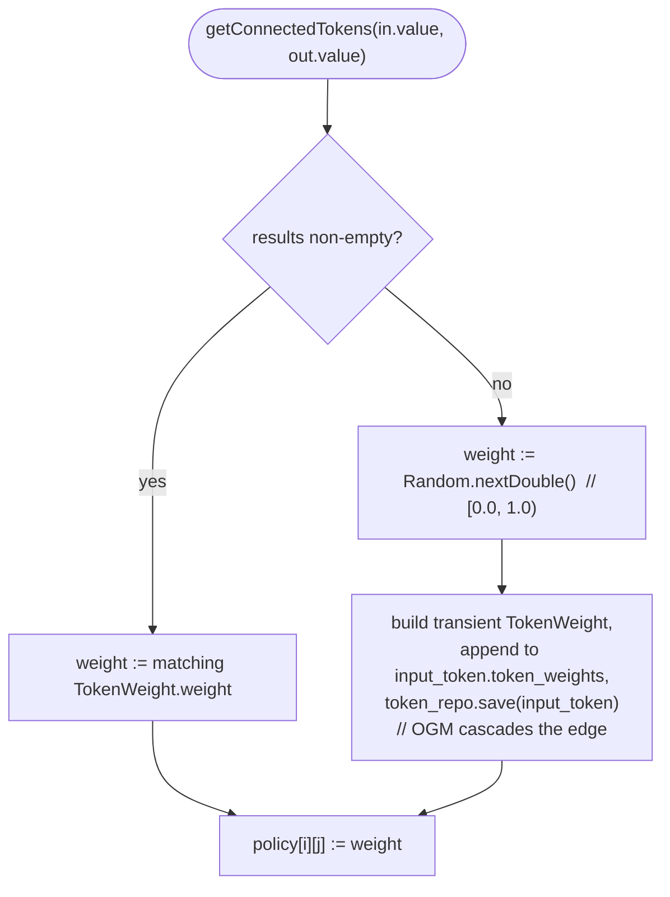
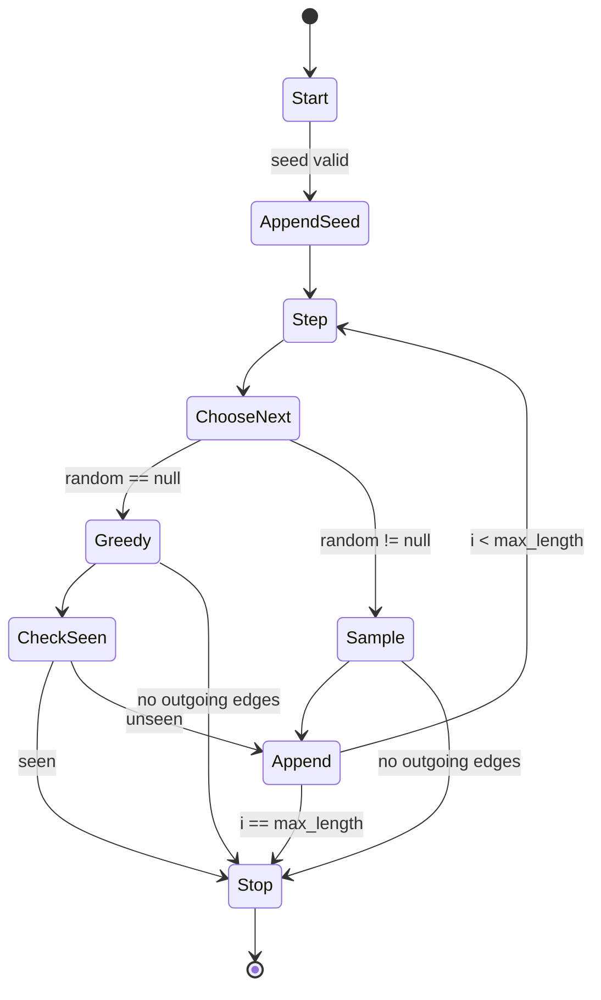
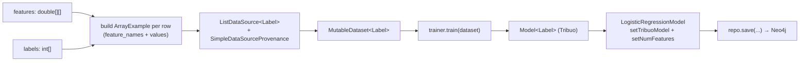
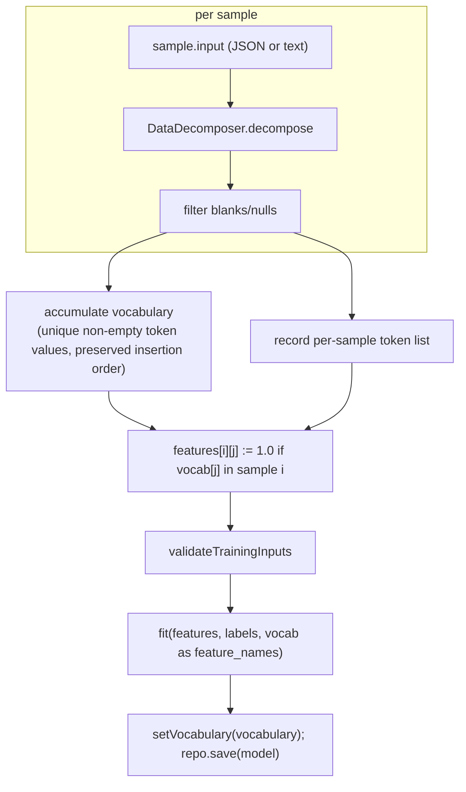
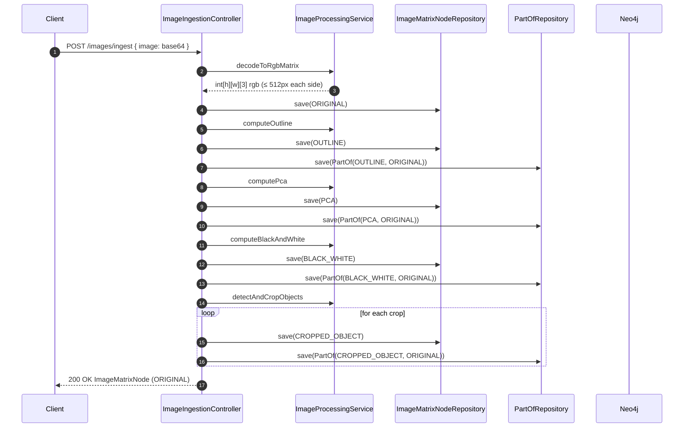

# Deepthought — Brain & ML Subsystems

> Engineering-level reference for the four model families implemented in
> the `com.qanairy.brain` package and the supporting services they call
> through. This is the file an engineer reaches for when they need the
> exact algorithm, the exact constants, or the exact failure mode.
>
> For the per-endpoint walkthroughs of `/rl/*` see
> [`PREDICT_ENDPOINT.md`](./PREDICT_ENDPOINT.md),
> [`LEARN_ENDPOINT.md`](./LEARN_ENDPOINT.md), and
> [`TRAIN_ENDPOINT.md`](./TRAIN_ENDPOINT.md). This document is the
> cross-cutting view.

---

## 1. Layout

```
src/main/java/com/deepthought/brain/
├── Brain.java                       // RL orchestrator: generatePolicy, predict, learn, train
├── QLearn.java                      // pure Q-learning update function
├── TokenVector.java                 // elastic-vector helpers (legacy)
├── Predict.java                     // generic Predict<T> interface
├── ActionFactory.java               // legacy action vocabulary
├── LanguageModelService.java        // bigram LM over HAS_RELATED_TOKEN
└── LogisticRegressionService.java   // Tribuo LinearSGDTrainer wrapper
```

```
src/main/java/com/qanairy/image/
└── ImageProcessingService.java      // OpenCV + Commons Math3 image pipeline
```

All `brain/` classes declare `package com.qanairy.brain;` even though
they sit under `com/deepthought/brain/` on disk. See
[`ARCHITECTURE.md`](./ARCHITECTURE.md) §4.1 for the package-vs-filesystem
crosswalk.

---

## 2. Reinforcement Learning (`Brain` + `QLearn`)

The `/rl/*` endpoints use `Brain` for orchestration and `QLearn` for the
one-line update arithmetic.

### 2.1 The model

**Parameters** are the `weight` properties on every
`HAS_RELATED_TOKEN` edge in Neo4j. There is no separate parameter file
or tensor; the graph *is* the model.

**State** is the bag of tokens derived from a single client request
plus the candidate output labels supplied with it.

**Action space** is whatever set of strings the client passes as
`output_tokens` — the model has no global notion of "all possible
actions". This makes it episode-local: every `/rl/predict` defines its
own action set.

### 2.2 `Brain.predict(double[][] policy) : double[]`

```java
double[] prediction = new double[policy[0].length];
for (int j = 0; j < policy[0].length; j++) {
    double sum = 0.0;
    for (int i = 0; i < policy.length; i++) {
        sum += policy[i][j];
    }
    prediction[j] = sum;
}
prediction = ArrayUtils.normalize(prediction);
return prediction;
```

- **Math:** column-sum then `edu.stanford.nlp.util.ArrayUtils.normalize`
  → divides by L1 norm. The result is non-negative iff the policy
  entries are non-negative (they are, post-`Math.abs` in learn and
  random in `[0, 1)` on cold-start).
- **Shape contract:** `policy` is `[input × output]`. The function
  **does not check** for `policy.length == 0`; it dereferences
  `policy[0]` immediately. An empty-input request from
  `/rl/predict` therefore crashes here — see
  [`PREDICT_ENDPOINT.md`](./PREDICT_ENDPOINT.md) §6.

### 2.3 `Brain.generatePolicy(List<Token>, List<Token>) : double[][]`

For each `(input_token, output_token)` pair:



Engineering notes:

- **Cold-start writes during predict.** The first time a pair
  `(in.value, out.value)` is scored, a new `HAS_RELATED_TOKEN` edge is
  materialized in Neo4j with a uniform random weight. So `/rl/predict`
  is not idempotent and not pure-read.
- **N·M Bolt round-trips.** No batching. Inputs and outputs above a few
  dozen each will visibly bottleneck.
- **Inner-loop edge resolution.** When a `HAS_RELATED_TOKEN` exists,
  the code iterates `tokens.get(0).getTokenWeights()` to find the one
  whose `end_token` matches the requested output. If multiple edges
  exist between the same pair (which can happen because there is no
  uniqueness constraint), the first matching one wins.

### 2.4 `Brain.learn(long memory_id, Token actual_token)`

Verbatim summary of the inner loop:

```java
QLearn q_learn = new QLearn(0.1, 0.1);  // α = γ = 0.1
double estimated_reward = 1.0;          // hard-coded Q_future
for (String output_key : memory.getOutputTokenKeys()) {
    // reward selection — see §2.5
    for (String input_key : memory.getInputTokenValues()) {
        memory.setDesiredToken(actual_token);   // in-memory only
        List<Token> tokens = token_repo.getConnectedTokens(input_key, output_key);
        TokenWeight tw = tokens.isEmpty()
            ? token_repo.createWeightedConnection(input_key, output_key, new Random().nextDouble())
            : tokens.get(0).getTokenWeights().get(0);
        double q = Math.abs(q_learn.calculate(tw.getWeight(), actual_reward, estimated_reward));
        tw.setWeight(q);
        token_weight_repo.save(tw);
    }
}
```

Effective formula:

```
Q' = | Q + 0.1 · (R + 0.1 · 1.0) |
   = | Q + 0.1·R + 0.01 |
```

### 2.5 Reward table

`Brain.learn` selects `R` per `(output_key, predicted_token, actual_token)` triple in this evaluation order:

| Condition | R |
|---|---|
| `output_key == actual_token` AND `actual_token == predicted_token` | **+2.0** |
| `output_key == actual_token` (predicted was something else) | **+1.0** |
| `output_key == predicted_token` AND `output_key != actual_token` | **−1.0** |
| `output_key != actual_token` (else branch) | **−2.0** |
| trailing `else` (unreachable) | 0.0 |

Worked examples and the `Math.abs` sign-flip caveat are in
[`LEARN_ENDPOINT.md`](./LEARN_ENDPOINT.md) §6.

### 2.6 `Brain.train(List<Token>, String)` — current state

`Brain.train` constructs a hard-coded `Vocabulary(new ArrayList<>(), "internet")`, appends every token, then iterates per-token to build a
local `boolean[]` state vector that is immediately discarded. **Nothing is persisted.** See
[`TRAIN_ENDPOINT.md`](./TRAIN_ENDPOINT.md) §10 for the full gap list.

### 2.7 `QLearn` — the entire class

```java
public class QLearn {
    private final double learning_rate;
    private final double discount_factor;

    public QLearn(double learning_rate, double discount_factor) {
        this.learning_rate = learning_rate;
        this.discount_factor = discount_factor;
    }

    public double calculate(double old_value, double actual_reward, double estimated_future_reward) {
        return (old_value + learning_rate * (actual_reward + (discount_factor * estimated_future_reward)));
    }
}
```

That is the complete contract — there is no Q-table, no eligibility
trace, no per-state-action structure beyond the edges in Neo4j.

### 2.8 Limitations baked into the current implementation

1. **`estimated_future_reward = 1.0` is constant.** Classical Q-learning
   takes this from `max_a' Q(s', a')`; here it is fixed.
2. **`Math.abs` is applied to every Q-update.** This prevents weights
   from going negative — useful because column-sum-then-normalize
   assumes non-negative entries — but it can flip the sign of an
   intended penalty. See [`LEARN_ENDPOINT.md`](./LEARN_ENDPOINT.md) §6.
3. **Per-edge save inside the inner loop.** `token_weight_repo.save`
   runs N·M times per call. There is no batching API in use.
4. **`memory.setDesiredToken(actual_token)` is in-memory only.** The
   memory record is never re-saved during learn.
5. **No off-policy correction / no exploration policy.** The system
   has no notion of ε-greedy or softmax sampling at *predict* time;
   it always returns argmax of the normalized column sums.

---

## 3. Language Model (`LanguageModelService`)

`/llm/*` reads the same `HAS_RELATED_TOKEN` edges and treats them as
**bigram transition weights**. Nothing is persisted.

### 3.1 Distribution

```java
public Map<String, Double> nextTokenDistribution(String seed)
```

Algorithm:

1. `token_repo.getTokenWeights(seed)` runs the Cypher
   `MATCH (s:Token{value:$seed})-[fw:HAS_RELATED_TOKEN]->(t:Token) RETURN s, fw, t`.
2. For each returned edge: `w := max(weight, 0.0)` (clamp negatives).
3. Accumulate per-target totals; sum `S` of all weights.
4. If `S ≤ 0.0` return empty `TreeMap`.
5. Otherwise normalize each `total[t] / S` and emit in a `TreeMap`
   (lexicographic order of target → deterministic iteration).

### 3.2 `predictNext`

Greedy argmax over `nextTokenDistribution`. Ties: lexicographic order
of target token (because the map iteration order is lex).

### 3.3 `sampleNext`

CDF sampling. With `r := random.nextDouble()`, walk the lex-ordered
distribution accumulating probability; the first key whose cumulative
sum `≥ r` is emitted. If the loop exits without returning (a
floating-point rounding case), the *last* visited key is returned.

### 3.4 `generate`

```java
List<String> generate(String seed, int max_length, Random random)
```

Semantics:

- `seed` must be non-null and non-empty.
- `max_length` in `[1, MAX_GENERATION_LENGTH = 1000]`.
- `random == null` → greedy mode with **cycle break**: if the next
  token has already been emitted, generation stops.
- `random != null` → stochastic mode, no cycle break.
- Stops early when the current token has no outgoing edges.



### 3.5 Why nothing is persisted

By design. The graph is mutated by `/rl/learn`; the LM endpoints read
the latest weights every call. There is no caching, no model snapshot,
no warm-up — the only state lives in Neo4j.

---

## 4. Logistic Regression (`LogisticRegressionService`)

A completely separate model family, persisted as opaque
`LogisticRegressionModel` nodes that don't touch the Token graph.

### 4.1 Trainer configuration

```java
LinearSGDTrainer trainer = new LinearSGDTrainer(
    new LogMulticlass(),                      // multinomial logistic loss
    SGD.getLinearDecaySGD(1.0),               // base learning rate 1.0, linear decay
    20,                                       // DEFAULT_EPOCHS
    Trainer.DEFAULT_SEED);                    // reproducible
```

- Loss: `LogMulticlass` — Tribuo's name for multinomial cross-entropy.
  With two classes (`"0"` and `"1"`) this is equivalent to binary
  logistic regression with a softmax head.
- Optimizer: `SGD.getLinearDecaySGD(1.0)` — vanilla SGD with linear
  learning-rate decay over the training run.
- Epochs: hard-coded `DEFAULT_EPOCHS = 20`.
- Seed: `Trainer.DEFAULT_SEED` for reproducibility.

### 4.2 Fit pipeline



### 4.3 Training inputs — validations

`validateTrainingInputs` (`LogisticRegressionService.java`) enforces:

| Condition | Failure |
|---|---|
| `features == null` or `labels == null` | `IllegalArgumentException` |
| `features.length == 0` | `IllegalArgumentException` |
| `features.length != labels.length` | `IllegalArgumentException` |
| `features.length < 2` | `IllegalArgumentException` |
| any label not in `{0, 1}` | `IllegalArgumentException` |
| all labels identical (one-class dataset) | `IllegalArgumentException` |
| any row null or length-0 | `IllegalArgumentException` |
| any row length ≠ first row length | `IllegalArgumentException` |

All `IllegalArgumentException`s are translated to HTTP 400 by
`LogisticRegressionController`'s `@ExceptionHandler`.

### 4.4 Token-based training (`trainFromTokens`)



Sample format:

```json
[
  {"input": "submit button", "label": 1},
  {"input": "footer",        "label": 0}
]
```

`output_labels` is a 2-element informational array (e.g.
`["noise", "action"]`) and must have exactly 2 entries.

### 4.5 Inference

```java
double predictProbability(LogisticRegressionModel model, double[] features)
double predictProbabilityFromInput(LogisticRegressionModel model, String input)
int predictClass(double probability)  // class 1 if probability >= 0.5 else class 0
```

Validation at inference:

- `features.length != model.getNumFeatures()` → `IllegalArgumentException` → 400.
- Numeric `predict` works on models trained either way (because both
  carry `num_features`).
- Token `predict-from-tokens` works **only** on models that have a
  non-empty `vocabulary_json` (i.e. trained via `trainFromTokens`). The
  service rejects the call otherwise with
  `"model was not trained from tokens; use the numeric predict endpoint"`.

### 4.6 Scoring math

```java
double scoreClassOne(Model<Label> tribuo, String[] feature_names, double[] features) {
    ArrayExample<Label> example = new ArrayExample<>(new Label("0"), feature_names, features);
    Prediction<Label> pred = tribuo.predict(example);
    Map<String, Label> scores = pred.getOutputScores();
    Label class_one = scores.get("1");
    return class_one == null ? 0.0 : class_one.getScore();
}
```

The label passed into the `ArrayExample` at inference is a placeholder
(Tribuo requires *some* label even when predicting). The class-1
probability is extracted by name from the prediction's `outputScores`
map.

### 4.7 Persistence quirks

- The Tribuo model is serialized via Java `ObjectOutputStream` then
  Base64-encoded into `LogisticRegressionModel.model_bytes`. This is
  fragile to Tribuo class layout changes — upgrading the Tribuo
  library version can invalidate previously-saved models.
- `Vocabulary_json` is serialized with Gson. `null` and empty strings
  are tolerated by the getter.

---

## 5. Image Processing (`ImageProcessingService`)

A pure pre-processing pipeline. No ML inference happens here — the
service produces alternative views of an image and the ingestion
controller persists each as a separate node.

### 5.1 Dependencies and runtime requirements

- OpenCV (JavaCPP artifact `org.openpnp:opencv:4.5.5-0`) — loaded via
  `nu.pattern.OpenCV.loadShared()` from a `@PostConstruct` `init()`.
- Apache Commons Math3 (`commons-math3:3.6.1`) — used for
  `EigenDecomposition` in `computePca`.
- Native libs require a glibc Linux runtime; the project's `Dockerfile`
  uses Debian-based `eclipse-temurin:8-jre` accordingly. An Alpine /
  musl base would break OpenCV native loading.

### 5.2 Constant

```java
private static final int MAX_DIMENSION = 512;
```

Both width and height are capped at 512 pixels before any further
processing. Anything larger is downscaled (aspect ratio preserved).
The cap is justified by Neo4j property size limits — the entire
`int[h][w][3]` RGB matrix is serialized to JSON and stored as a single
node property.

### 5.3 Per-derivation algorithms

| Derivation | Algorithm |
|---|---|
| `ORIGINAL` | Just the downscaled RGB matrix from `decodeToRgbMatrix`. |
| `OUTLINE` | RGB → grayscale (`COLOR_BGR2GRAY`) → 3×3 Gaussian blur → `Imgproc.Canny(blurred, edges, 50, 150)` → back to RGB. |
| `PCA` | Each pixel as 3D vector → centered → covariance → `EigenDecomposition` → project onto top components → reconstruct. |
| `BLACK_WHITE` | Per-pixel grayscale `gray = 0.299·R + 0.587·G + 0.114·B`, clamped to `[0, 255]`. The same `gray` value is written to all three RGB channels — the result is a grayscale image (R=G=B), **not** a binary mask. No threshold is applied. |
| `CROPPED_OBJECT` | RGB → grayscale → `findContours(..., RETR_EXTERNAL, CHAIN_APPROX_SIMPLE)` → bounding rectangle per contour → filter tiny boxes → crop. |

All OpenCV `Mat` objects are explicitly `.release()`'d at the end of
each method to avoid native-memory leaks.

### 5.4 End-to-end ingestion lifecycle



Failure modes:

- Empty or null `image` field → `400 Bad Request` (early controller check).
- Base64 decode produces an empty byte array → `IllegalArgumentException`
  → `400`.
- `ImageIO.read` returns `null` (unsupported format) → `IllegalArgumentException`
  → `400`.
- `IOException` during decode → `500` with body.
- Any other exception in the pipeline → `500` with body.

---

## 6. Inputs — `DataDecomposer`

`DataDecomposer` is the shared front-end for any text/JSON the brain
will turn into tokens.

| Entry point | Behavior |
|---|---|
| `decompose(JSONObject json)` | Iterates keys; tokenizes only **values**. Keys are read for logging but not turned into tokens. **Nested `JSONObject` recurses into `decompose(JSONObject)`. `JSONArray` does NOT recurse** — each element is converted via `Object.toString()` and routed through the `decompose(String)` overload, so an object embedded in an array tokenizes as the raw JSON text of that object (e.g. `[{"k":"v"}]` produces the single token `{"k":"v"}`). Strings are split on whitespace. |
| `decompose(String text)` | Whitespace split. |
| `decompose(Object obj)` | Reflective dispatcher for arbitrary objects. |
| `decompose(HashMap<?, ?>)` | Same key/value behavior as JSONObject. |
| `decomposeObjectArray(Object[])` / `decomposeArrayList(ArrayList<?>)` | Flatten + recurse. |

A consequence visible in
[`PREDICT_ENDPOINT.md`](./PREDICT_ENDPOINT.md):
`{"page":"login form"}` yields tokens `login` and `form`. `page` is
never tokenized.

`/rl/predict`, `/rl/train`, and the two `/lr/*-from-tokens` endpoints
funnel through this class. `/rl/learn` does **not** — it consumes only
`memory_id` plus the `token_value` string and never calls
`DataDecomposer`. Tokenization changes here affect prediction and
training paths but leave the feedback path untouched.

---

## 7. Cross-Subsystem Comparison

| Concern | `/rl` (Brain + QLearn) | `/llm` (LanguageModelService) | `/lr` (LogisticRegressionService) | `/images` (ImageProcessingService) |
|---|---|---|---|---|
| Parameters live in | `HAS_RELATED_TOKEN.weight` | (reuses RL params) | `LogisticRegressionModel.model_bytes` (Tribuo) | n/a — pre-processing |
| Read path | column-sum + L1 normalize | clamp-neg + L1 normalize per seed | Tribuo `Model<Label>.predict` | n/a |
| Write path | cold-start random + Q-update | none | Tribuo SGD fit + Neo4j save | save matrix nodes + PART_OF |
| Determinism | reads deterministic; writes random on cold-start | deterministic for greedy; seeded random for sample | deterministic given seed + data | deterministic |
| Idempotent? | no (cold-start + memory creation) | yes (read-only) | no for train, yes for predict | no |
| Failure on empty input | crashes in `Brain.predict` (`policy[0]`) | `IllegalArgumentException` | `IllegalArgumentException` | `IllegalArgumentException` |
| Persistence model | mutable edges in Neo4j | none | Java-serialized Tribuo blob in Neo4j | append-only Neo4j nodes (no dedup; identical payloads duplicate) |
| Hot reload of learned state | yes (live edge reads) | yes (live edge reads) | requires re-load by `model_id` | n/a |

---

## 8. Files & line anchors

| Topic | File |
|---|---|
| Predict, learn, train orchestration | `src/main/java/com/deepthought/brain/Brain.java` |
| Q-update arithmetic | `src/main/java/com/deepthought/brain/QLearn.java` |
| Elastic-vector helper | `src/main/java/com/deepthought/brain/TokenVector.java` |
| Generic predict interface | `src/main/java/com/deepthought/brain/Predict.java` |
| Static action vocabulary (legacy) | `src/main/java/com/deepthought/brain/ActionFactory.java` |
| Bigram LM | `src/main/java/com/deepthought/brain/LanguageModelService.java` |
| Tribuo wrapper | `src/main/java/com/deepthought/brain/LogisticRegressionService.java` |
| Image pipeline | `src/main/java/com/qanairy/image/ImageProcessingService.java` |
| Token decomposition | `src/main/java/com/deepthought/db/DataDecomposer.java` |

For controllers and repositories see
[`ARCHITECTURE.md`](./ARCHITECTURE.md) §4.
