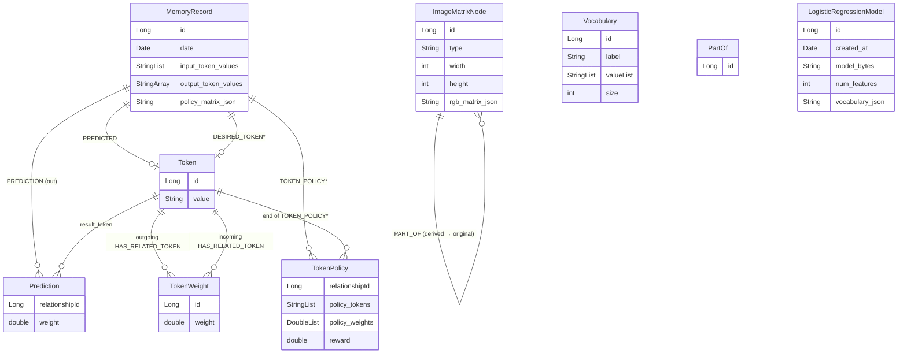

# Deepthought — Data Model (Neo4j)

> Authoritative reference for every node label, every relationship type,
> every property, and every Cypher query the application executes against
> Neo4j. Targets Spring Data Neo4j 5.2.x / Neo4j OGM 3.2.x running against
> Neo4j 4.4.

For the surrounding architecture, see [`ARCHITECTURE.md`](./ARCHITECTURE.md).
For per-endpoint write semantics, see
[`PREDICT_ENDPOINT.md`](./PREDICT_ENDPOINT.md) and
[`LEARN_ENDPOINT.md`](./LEARN_ENDPOINT.md).

---

## 1. Full Graph Schema



*Relationships marked `*` are declared in code but not actually written
by any production code path today. See §9.*

---

## 2. Node Labels

### 2.1 `Token`

The atomic unit of knowledge.

- **Source:** `src/main/java/com/deepthought/models/Token.java`
- **OGM annotation:** `@NodeEntity`
- **Properties:**

  | Property | Java type | Neo4j type | Constraints |
  |---|---|---|---|
  | `id` | `Long` | internal id | `@Id @GeneratedValue` |
  | `value` | `String` | String | `@NotBlank` (bean-validation) |

- **Outgoing relationship fields** (OGM-mapped, not properties on the node):
  - `@Relationship(type = "HAS_RELATED_TOKEN") List<TokenWeight> token_weights`

- **Equality:** `Token.equals` is overridden to compare by `value`,
  but `Token.hashCode` is **not** overridden — it inherits the default
  identity-based hash from `java.lang.Object`. This breaks the
  `equals`/`hashCode` contract for hashed collections: two `Token`
  instances with the same `value` will compare equal but hash to
  different buckets, so they do not deduplicate in `HashSet` /
  `HashMap`. Code that needs set semantics on `value` should hash on
  `getValue()` explicitly.

- There is **no Neo4j uniqueness constraint** on `Token.value`, so the
  application logic must call `findByValue` before creating a new
  `Token`. If two requests race the cold-start path you can end up
  with duplicate `Token` nodes that share a value.

- **Recommended constraint** (not currently created):
  ```cypher
  CREATE CONSTRAINT token_value_unique IF NOT EXISTS
  FOR (t:Token) REQUIRE t.value IS UNIQUE;
  ```

### 2.2 `Vocabulary`

- **Source:** `src/main/java/com/deepthought/models/Vocabulary.java`
- **OGM annotation:** `@NodeEntity`
- **Properties:**

  | Property | Java type | Constraints |
  |---|---|---|
  | `id` | `Long` | `@Id @GeneratedValue` |
  | `label` | `String` | `@NotBlank @Property` |
  | `valueList` | `List<String>` | `@Property` (stored as a Neo4j list of strings) |
  | `size` | `int` | `@Property` — kept in sync with `valueList.size()` by `addWord`, `clear`, and `initializeMappings`; used by `VocabularyRepository.findBySize*` derived queries |

- **Transient (not persisted):** `wordToIndexMap`, `nextIndex` are
  in-memory caches for index lookups and word counting.

- **Status:** A `VocabularyRepository` exists, but the only code that
  creates a `Vocabulary` instance is `Brain.train`, which **does not
  call `vocabulary_repo.save(...)`**. As of writing, no `:Vocabulary`
  nodes ever land in Neo4j through normal flows. See
  [`TRAIN_ENDPOINT.md`](./TRAIN_ENDPOINT.md) for details.

### 2.3 `MemoryRecord`

The audit trail for a single `/rl/predict` call.

- **Source:** `src/main/java/com/deepthought/models/MemoryRecord.java`
- **OGM annotation:** `@NodeEntity`
- **Properties:**

  | Property | Java type | Notes |
  |---|---|---|
  | `id` | `Long` | `@Id @GeneratedValue` |
  | `date` | `Date` | Set in constructor to `new Date()` |
  | `input_token_values` | `List<String>` | The scrubbed, deduped input keys |
  | `output_token_values` | `String[]` | The exact output labels scored, in order. **Getter is `getOutputTokenKeys()`** — this is what the JSON-serialized API response field is named (`outputTokenKeys`). |
  | `policy_matrix_json` | `String` | Gson-serialized `double[][]`. The getter `getPolicyMatrix()` deserializes on read; the setter serializes on write |

- **Outgoing relationship fields:**
  - `@Relationship(type = "DESIRED_TOKEN") Token desired_token` — written
    in-memory by `Brain.learn` but **never persisted** (no
    `memory_repo.save` follows).
  - `@Relationship(type = "PREDICTED") Token predicted_token` — written
    by `/rl/predict` (`memory_repo.save(memory)` after
    `setPredictedToken`).
  - `@Relationship(type = "PREDICTION", direction = OUTGOING) List<Prediction> predictions`
    — populated by `/rl/predict` after creating prediction edges.

- **No `@Index`** on any property today. Lookups are done via
  `findById` only.

### 2.4 `ImageMatrixNode`

Stores a single raster as a 3D RGB matrix serialized to JSON.

- **Source:** `src/main/java/com/deepthought/models/ImageMatrixNode.java`
- **OGM annotation:** `@NodeEntity`
- **Java enum:**
  ```java
  public enum Type { ORIGINAL, OUTLINE, PCA, BLACK_WHITE, CROPPED_OBJECT }
  ```
- **Properties:**

  | Property | Java type | Notes |
  |---|---|---|
  | `id` | `Long` | `@Id @GeneratedValue` |
  | `type` | `String` | The `Type` enum's `name()` |
  | `width` | `int` | Pixels |
  | `height` | `int` | Pixels |
  | `rgb_matrix_json` | `String` | Gson-serialized `int[height][width][3]`. `@JsonIgnore` so it does **not** appear in API responses. |

- **Outgoing relationship fields:** none (the `PART_OF` edge is owned by
  the relationship entity `PartOf`).

### 2.5 `LogisticRegressionModel`

A self-contained, queryable Tribuo model.

- **Source:** `src/main/java/com/deepthought/models/LogisticRegressionModel.java`
- **OGM annotation:** `@NodeEntity`
- **Properties:**

  | Property | Java type | Notes |
  |---|---|---|
  | `id` | `Long` | `@Id @GeneratedValue` |
  | `created_at` | `Date` | Set in constructor |
  | `model_bytes` | `String` | Base64 of `ObjectOutputStream`-serialized Tribuo `Model<Label>`. `@JsonIgnore` |
  | `num_features` | `int` | Used for inference-time validation |
  | `vocabulary_json` | `String` | Gson-serialized `List<String>` (only set by `/lr/train-from-tokens`). `@JsonIgnore` |

- **Helper methods:**
  - `getTribuoModel()` decodes Base64 → `ObjectInputStream` →
    `readObject()` and returns a hydrated Tribuo `Model<Label>`. Throws
    `IllegalStateException` on deserialization failure.
  - `setTribuoModel(Model<Label>)` reverses the process.
  - `getVocabulary()` / `setVocabulary(List<String>)` round-trip via
    Gson. `null` and empty string are tolerated.

- **No relationships.** This node is intentionally an island.

---

## 3. Relationship Types

### 3.1 `HAS_RELATED_TOKEN` (via `TokenWeight`)

The learnable weights.

- **Source:** `src/main/java/com/deepthought/models/edges/TokenWeight.java`
- **OGM annotation:** `@RelationshipEntity(type = "HAS_RELATED_TOKEN")`
- **Endpoints:**
  - `@StartNode Token token` — source
  - `@EndNode Token end_token` — target (directed)
- **Properties:**

  | Property | Java type | Notes |
  |---|---|---|
  | `id` | `Long` | `@Id @GeneratedValue` |
  | `weight` | `double` | `@Property`. Read on `/rl/predict`, written on cold-start and on every `/rl/learn` |

- **Lifecycle:**
  - Created in two places:
    1. `Brain.generatePolicy` cold-start: builds a transient
       `TokenWeight` with a random `[0.0, 1.0)` weight, appends it to
       the input token's `token_weights` list, and calls
       `TokenRepository.save(input_token)`. OGM cascades the
       relationship through the parent-token save — neither
       `TokenWeightRepository.save` nor `createWeightedConnection` is
       invoked on this path.
    2. `Brain.learn` cold-start: calls
       `TokenRepository.createWeightedConnection(...)` (the
       `MATCH ... CREATE rel` Cypher) directly, then applies the
       Q-update on the returned `TokenWeight`.
  - Updated only by `/rl/learn` (via `TokenWeightRepository.save` of the
    same relationship instance with mutated `weight`).
  - Read on `/rl/predict`, `/rl/learn`, and **all** `/llm/*` endpoints.

### 3.2 `PREDICTION` (via `Prediction`)

The fanout of one `MemoryRecord` to each scored candidate.

- **Source:** `src/main/java/com/deepthought/models/edges/Prediction.java`
- **OGM annotation:** `@RelationshipEntity(type = "PREDICTION")`
- **Endpoints:**
  - `@StartNode MemoryRecord memory`
  - `@EndNode Token result_token`
- **Properties:**

  | Property | Java type | Notes |
  |---|---|---|
  | `relationshipId` | `Long` | `@Id @GeneratedValue` |
  | `weight` | `double` | The normalized probability for that candidate at prediction time |

- **Lifecycle:** Written by `/rl/predict` — one per output candidate.
  Never updated. Never deleted by the application.

### 3.3 `PREDICTED` (implicit on `MemoryRecord.predicted_token`)

- **Mapped from:** `MemoryRecord.@Relationship(type = "PREDICTED") Token predicted_token`
- **No `@RelationshipEntity`** — there are no edge properties; OGM
  manages the edge directly.
- **Lifecycle:** Set once by `/rl/predict` when `memory_repo.save` runs
  with `predicted_token` populated. Never updated.

### 3.4 `DESIRED_TOKEN` (declared, not persisted today)

- **Mapped from:** `MemoryRecord.@Relationship(type = "DESIRED_TOKEN") Token desired_token`
- **Lifecycle in code:** `Brain.learn` calls
  `memory.setDesiredToken(actual_token)` (`Brain.java`) but does **not**
  re-save the memory. The mutation never reaches Neo4j today; see
  [`LEARN_ENDPOINT.md`](./LEARN_ENDPOINT.md) §10.

### 3.5 `TOKEN_POLICY` (via `TokenPolicy`)

- **Source:** `src/main/java/com/deepthought/models/edges/TokenPolicy.java`
- **OGM annotation:** `@RelationshipEntity(type = "TOKEN_POLICY")`
- **Endpoints:** `@StartNode MemoryRecord`, `@EndNode Token`
- **Properties:** `relationshipId : Long` (`@Id @GeneratedValue`),
  `policy_tokens : List<String>`, `policy_weights : List<Double>`,
  `reward : double`
- **Lifecycle:** No code path constructs or saves this relationship
  entity today. It is reserved schema only.

### 3.6 `PART_OF` (via `PartOf`)

The image-derivation graph.

- **Source:** `src/main/java/com/deepthought/models/edges/PartOf.java`
- **OGM annotation:** `@RelationshipEntity(type = "PART_OF")`
- **Endpoints:**
  - `@StartNode ImageMatrixNode part` (derived: `OUTLINE`, `PCA`,
    `BLACK_WHITE`, `CROPPED_OBJECT`)
  - `@EndNode ImageMatrixNode whole` (the `ORIGINAL`)
- **Direction:** *derived → original*. In Cypher:
  `(derived:ImageMatrixNode)-[:PART_OF]->(original:ImageMatrixNode)`.
  This was verified against `ImageIngestionController.ingest`, which
  calls `new PartOf(outline_node, original)` — `part` first, `whole`
  second.
- **Properties:** only `id`.

---

## 4. Cypher Vocabulary (verbatim queries the app issues)

### 4.1 `TokenRepository`

```java
public Token findByValue(@Param("value") String value);
```
Spring Data derived query; effective Cypher:
```cypher
MATCH (t:Token { value: $value }) RETURN t
```

```cypher
// TokenRepository.getTokenWeights
MATCH (s:Token{value:{value}})-[fw:HAS_RELATED_TOKEN]->(t:Token)
RETURN s, fw, t
```
Used by `LanguageModelService.nextTokenDistribution` to build per-seed
distributions. `Brain` does **not** call this method — its RL traversal
goes through `getConnectedTokens` (see below).

```cypher
// TokenRepository.getConnectedTokens
MATCH p=(f1:Token{value:{input_value}})-[fw:HAS_RELATED_TOKEN]->(f2:Token{value:{output_value}})
RETURN f1, fw, f2
```
Used by `Brain.generatePolicy` and `Brain.learn` to look up a single
`(input, output)` edge.

```cypher
// TokenRepository.createWeightedConnection
MATCH (f_in:Token),(f_out:Token)
WHERE f_in.value = {input_value} AND f_out.value = {output_value}
CREATE (f_in)-[r:HAS_RELATED_TOKEN { weight: {weight} }]->(f_out)
RETURN r
```
Cold-start edge creation in `Brain.learn`.

> Note: this **requires both end-point `Token` nodes to already exist**
> in Neo4j. `Brain.learn` itself does not save tokens, so the path
> "predict-then-learn" must have already persisted the tokens during
> the predict step.

### 4.2 `VocabularyRepository`

Twelve custom methods beyond inherited CRUD, mixing Spring Data derived
queries and explicit `@Query` Cypher. Note that `:Vocabulary` nodes are
never written by the production application today (see
[`TRAIN_ENDPOINT.md`](./TRAIN_ENDPOINT.md)), so these are reachable
only via tests or operator-supplied data.

**Derived queries** (Cypher generated by Spring Data from the method
name):

| Method | Effective Cypher pattern |
|---|---|
| `findByLabel(String label) : Optional<Vocabulary>` | `MATCH (v:Vocabulary {label: $label}) RETURN v` |
| `existsByLabel(String label) : boolean` | `MATCH (v:Vocabulary {label: $label}) RETURN count(v) > 0` |
| `findBySizeGreaterThan(int minSize) : List<Vocabulary>` | `MATCH (v:Vocabulary) WHERE v.size > $minSize RETURN v` |
| `findBySizeBetween(int minSize, int maxSize) : List<Vocabulary>` | `MATCH (v:Vocabulary) WHERE v.size >= $minSize AND v.size <= $maxSize RETURN v` |

**Explicit `@Query` methods:**

```cypher
// findByWord — vocabularies containing a given word
MATCH (v:Vocabulary) WHERE $word IN v.valueList RETURN v

// findByLabelContainingIgnoreCase — case-insensitive label substring search
MATCH (v:Vocabulary)
WHERE toLower(v.label) CONTAINS toLower($pattern)
RETURN v

// countAllVocabularies
MATCH (v:Vocabulary) RETURN count(v)

// getAverageVocabularySize
MATCH (v:Vocabulary) RETURN avg(v.size)

// findLargestVocabulary
MATCH (v:Vocabulary) RETURN v ORDER BY v.size DESC LIMIT 1

// findSimilarVocabularies — neighbors that share at least minSharedWords words
MATCH (v1:Vocabulary) WHERE id(v1) = $vocabularyId
MATCH (v2:Vocabulary) WHERE id(v2) <> $vocabularyId
WITH v1, v2, [word IN v1.valueList WHERE word IN v2.valueList] AS shared
WHERE size(shared) >= $minSharedWords
RETURN v2 ORDER BY size(shared) DESC

// deleteSmallVocabularies — DESTRUCTIVE: detach-deletes vocabularies whose size < $maxSize
MATCH (v:Vocabulary) WHERE v.size < $maxSize DETACH DELETE v RETURN count(v)

// updateAllSizes — reconcile v.size with size(v.valueList) across all vocabularies
MATCH (v:Vocabulary) SET v.size = size(v.valueList)
```

`deleteSmallVocabularies` is the only destructive operation declared
anywhere in the repository layer; everything else in the data tier is
non-destructive.

### 4.3 Other repositories

The remaining repositories (`TokenWeightRepository`,
`MemoryRecordRepository`, `PredictionRepository`,
`ImageMatrixNodeRepository`, `PartOfRepository`,
`LogisticRegressionModelRepository`) extend `Neo4jRepository<T, Long>`
and use only the inherited CRUD operations:

| Method | Effective Cypher |
|---|---|
| `save(T entity)` | OGM-managed `MERGE`/`CREATE` + property `SET` |
| `findById(Long id)` | `MATCH (n:<Label>) WHERE id(n) = $id OPTIONAL MATCH (n)-[r]-(o) RETURN n, r, o` (OGM relationship hydration depth ≤ 1 by default) |
| `findAll()` | `MATCH (n:<Label>) RETURN n` |
| `deleteById(Long)` | `MATCH (n) WHERE id(n) = $id DETACH DELETE n` |
| `count()` | `MATCH (n:<Label>) RETURN count(n)` |

---

## 5. Per-Endpoint Read/Write Effects

The high-level picture of which endpoints write which entities is
helpful when reasoning about idempotency, dirty reads, and migration
plans.

| Endpoint | `Token` | `HAS_RELATED_TOKEN` | `MemoryRecord` | `PREDICTED` | `PREDICTION` | `DESIRED_TOKEN` | `ImageMatrixNode` | `PART_OF` | `LogisticRegressionModel` |
|---|:---:|:---:|:---:|:---:|:---:|:---:|:---:|:---:|:---:|
| `POST /rl/predict` | R + W on cold-start | R + W on cold-start | W | W | W | — | — | — | — |
| `POST /rl/learn` | R | R + W | R | R | — | (in-memory only) | — | — | — |
| `POST /rl/train` | — | — | — | — | — | — | — | — | — |
| `GET /llm/distribution` | R | R | — | — | — | — | — | — | — |
| `POST /llm/predict-next` | R | R | — | — | — | — | — | — | — |
| `POST /llm/generate` | R (walks) | R (walks) | — | — | — | — | — | — | — |
| `POST /lr/train` | — | — | — | — | — | — | — | — | W |
| `POST /lr/predict` | — | — | — | — | — | — | — | — | R |
| `POST /lr/train-from-tokens` | — | — | — | — | — | — | — | — | W |
| `POST /lr/predict-from-tokens` | — | — | — | — | — | — | — | — | R |
| `POST /images/ingest` | — | — | — | — | — | — | W (1 ORIGINAL + 3 fixed + N cropped) | W (one per derived) | — |

Legend: R = read, W = write.

---

## 6. Operational Cypher Recipes

These queries are read-only and safe to run in the Neo4j Browser. They
are the everyday inspections an operator will want.

### 6.1 Inventory

```cypher
// Count every node label
MATCH (n) RETURN labels(n) AS label, count(*) AS n
ORDER BY n DESC;

// Count every relationship type
MATCH ()-[r]->()
RETURN type(r) AS rel, count(*) AS n
ORDER BY n DESC;
```

### 6.2 Top learned weights

```cypher
MATCH (a:Token)-[w:HAS_RELATED_TOKEN]->(b:Token)
RETURN a.value, w.weight, b.value
ORDER BY w.weight DESC
LIMIT 25;
```

### 6.3 Inspect a single MemoryRecord

```cypher
MATCH (m:MemoryRecord) WHERE id(m) = $memory_id
OPTIONAL MATCH (m)-[pe:PREDICTION]->(pt:Token)
OPTIONAL MATCH (m)-[:PREDICTED]->(predicted:Token)
OPTIONAL MATCH (m)-[:DESIRED_TOKEN]->(desired:Token)
RETURN m, collect({weight: pe.weight, token: pt.value}) AS predictions,
       predicted.value AS predicted, desired.value AS desired;
```

### 6.4 Look up all edges between two specific token values

```cypher
MATCH (a:Token {value: $input})-[r:HAS_RELATED_TOKEN]->(b:Token {value: $output})
RETURN a, r, b;
```

### 6.5 List every image originally ingested

```cypher
MATCH (o:ImageMatrixNode {type: 'ORIGINAL'})
OPTIONAL MATCH (derived:ImageMatrixNode)-[:PART_OF]->(o)
RETURN id(o) AS id, o.width, o.height,
       collect({id: id(derived), type: derived.type}) AS derived;
```

> Note: `ImageMatrixNode` (and every other `@NodeEntity` in this codebase)
> uses `@Id @GeneratedValue` on a `Long id` field, which maps to Neo4j's
> internal node id rather than a stored `id` property. Use `id(node)`
> in Cypher, not `node.id`.

### 6.6 Find image derivatives by type

```cypher
MATCH (d:ImageMatrixNode)-[:PART_OF]->(o:ImageMatrixNode {type: 'ORIGINAL'})
WHERE d.type = 'CROPPED_OBJECT'
RETURN id(o) AS id, count(d) AS num_objects;
```

### 6.7 List trained logistic-regression models

```cypher
MATCH (m:LogisticRegressionModel)
RETURN id(m) AS id, m.num_features AS num_features,
       size(m.vocabulary_json) > 0 AS has_vocabulary,
       m.created_at AS created_at
ORDER BY m.created_at DESC;
```

---

## 7. Recommended Constraints and Indexes

None of these are created by the application today. They are listed
here as the obvious next step for any deployment that grows beyond a
demo.

```cypher
// Uniqueness for token lookups (fast findByValue, prevents duplicate races)
CREATE CONSTRAINT token_value_unique IF NOT EXISTS
FOR (t:Token) REQUIRE t.value IS UNIQUE;

// Speed up MemoryRecord audit queries
CREATE INDEX memory_date IF NOT EXISTS FOR (m:MemoryRecord) ON (m.date);

// Image type filter
CREATE INDEX image_type IF NOT EXISTS FOR (n:ImageMatrixNode) ON (n.type);

// Vocabulary label lookup
CREATE CONSTRAINT vocab_label_unique IF NOT EXISTS
FOR (v:Vocabulary) REQUIRE v.label IS UNIQUE;
```

The `Token.value` unique constraint in particular would let the app
drop the `findByValue` precheck pattern in favour of a single
`MERGE`, which would eliminate the duplicate-token race in cold-start
predict.

---

## 8. Data Lifecycle & Retention

The application **never deletes** anything from Neo4j. Every
prediction adds a `MemoryRecord` + `PREDICTION` edges (and on
cold-start adds new `Token` nodes and `HAS_RELATED_TOKEN` edges via
`Brain.generatePolicy`); every ingest adds an `ImageMatrixNode`
cluster. `/rl/learn` only adds an edge when one is missing — its
Cypher (`TokenRepository.createWeightedConnection`) is a `MATCH ...
CREATE rel`, so it requires both endpoint tokens to already exist
and never creates `Token` nodes itself. Disk usage grows
monotonically.

For long-running deployments a retention strategy is needed:

```cypher
// Example: delete MemoryRecords older than 30 days (with their PREDICTION edges)
// MemoryRecord.date is a java.util.Date that Spring Data Neo4j / OGM 3.2
// persists as an ISO-8601 string, so it must be parsed via datetime()
// before comparing to a temporal value.
MATCH (m:MemoryRecord)
WHERE datetime(m.date) < datetime() - duration({days: 30})
DETACH DELETE m;

// Example: keep only the most recent ORIGINAL per logical-image key
//          (requires adding a logical key — not implemented today)
```

The application has no built-in TTL or compaction logic.

---

## 9. Dormant / Aspirational Schema

To keep the schema honest, here is everything that is **declared** in
code but **not populated** by any current code path:

| Element | Why it's dormant | Where it would live |
|---|---|---|
| `(:Vocabulary)` node label | `Brain.train` constructs one in memory but never saves it | Would need `vocabulary_repo.save(...)` in `Brain.train` and persistence of token references |
| `MemoryRecord.desired_token` / `DESIRED_TOKEN` edge | `Brain.learn` mutates the in-memory entity but never re-saves the `MemoryRecord` | Add `memory_repo.save(memory)` after the inner loop in `Brain.learn` |
| `TOKEN_POLICY` relationship type (mapped by the `TokenPolicy` Java class) | No code creates it | Reserved for storing per-prediction policy reward audit |

When extending the system, these are the natural places to start —
they already have OGM mappings, repositories where applicable, and a
clear semantic intent.

---

## 10. Quick Reference — Files

| Concern | File |
|---|---|
| Nodes | `src/main/java/com/deepthought/models/Token.java`, `Vocabulary.java`, `MemoryRecord.java`, `ImageMatrixNode.java`, `LogisticRegressionModel.java` |
| Relationship entities | `src/main/java/com/deepthought/models/edges/TokenWeight.java`, `Prediction.java`, `TokenPolicy.java`, `PartOf.java` |
| Repositories | `src/main/java/com/deepthought/models/repository/*.java` |
| Service-layer wrapper | `src/main/java/com/deepthought/models/services/TokenService.java` |
| Bean wiring & SessionFactory | `src/main/java/com/deepthought/config/Neo4jConfiguration.java` |
| Env-var resolution | `src/main/java/com/deepthought/config/ConfigService.java` |
