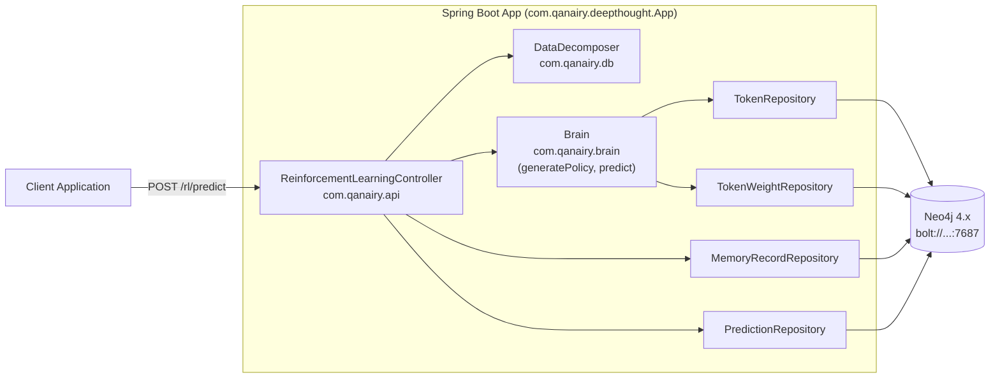
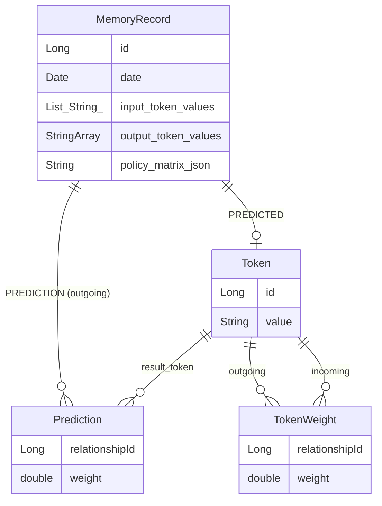
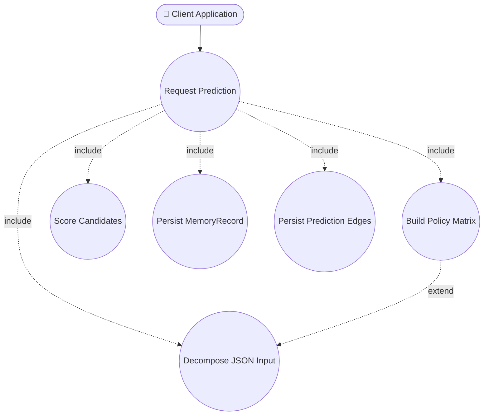
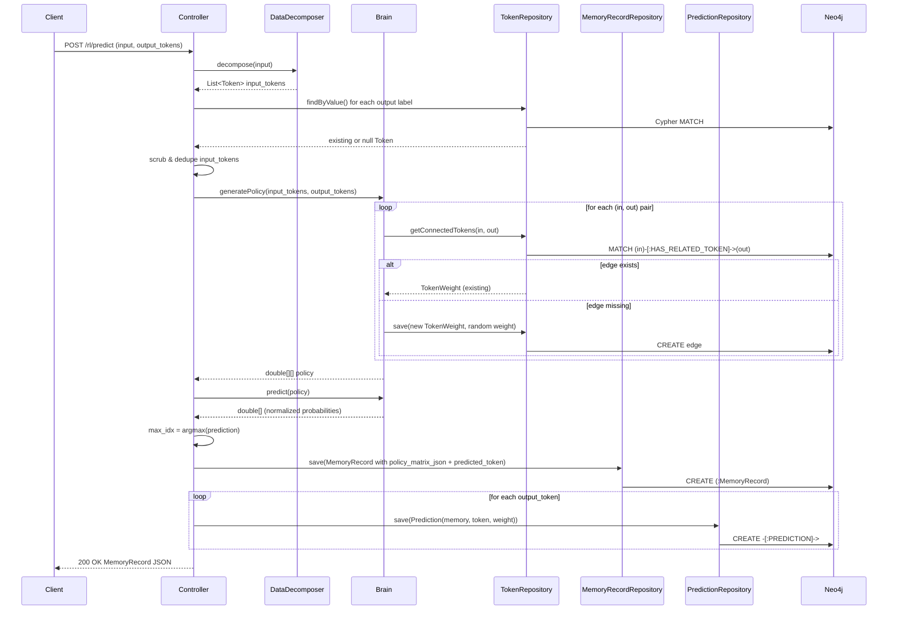

# Reinforcement Learning API — `POST /rl/predict`

This document explains how a request to `/rl/predict` becomes a graph-backed
prediction: the components it touches, the Neo4j data it reads and writes,
and the procedure step-by-step. It is the canonical reference for the
predict endpoint.

> Scope: this document covers `/rl/predict` only. The `/rl/learn` and
> `/rl/train` endpoints are intentionally out of scope and are not described
> here.
>
> All `file:line` citations are anchored to the source as of writing. The
> primary controller lives at
> `src/main/java/com/deepthought/api/ReinforcementLearningController.java`.

---

## 1. Overview

Deepthought is a graph-based reinforcement-learning engine. Predictions are
produced by reading **`Token` → `Token`** edges out of Neo4j and treating
their weights as a policy matrix. There are no GPUs and no dense neural
networks — the prediction is a column-sum over a sparse matrix of learned
edge weights, normalized into a probability distribution.

A single call to `POST /rl/predict`:

- Takes an arbitrary JSON (or plain-text) input plus a list of candidate
  output labels.
- Returns a `MemoryRecord` JSON containing a probability distribution over
  the candidates, the chosen winner, and the policy matrix that produced it.
- Persists the `MemoryRecord` plus one `PREDICTION` edge per candidate label
  so the prediction can be audited or fed back into a learning step later.

The id on the returned `MemoryRecord` is the handle a future feedback call
would use; consuming that id is **not** part of this document.

---

## 2. System Architecture



**Package layout note.** Use the **package declaration** (not the filesystem
path) when importing or searching for these classes:

| Class | Package declaration | Filesystem path |
|---|---|---|
| `ReinforcementLearningController` | `com.qanairy.api` | `src/main/java/com/deepthought/api/ReinforcementLearningController.java` |
| `DataDecomposer` | `com.qanairy.db` | `src/main/java/com/deepthought/db/DataDecomposer.java` |
| `Brain` | `com.qanairy.brain` | `src/main/java/com/deepthought/brain/Brain.java` |
| `TokenVector` | `com.qanairy.brain` | `src/main/java/com/deepthought/brain/TokenVector.java` |
| `App` | `com.qanairy.deepthought` | `src/main/java/com/deepthought/deepthought/App.java` |

`App.java` declares
`@ComponentScan(basePackages = {"com.deepthought","com.qanairy"})`, so both
roots are wired into the Spring context and this divergence does not affect
runtime. The labels on the architecture diagram above use the package
declarations, since that is what `import` statements and IDE search target.
Filesystem paths in the §8 source map use the on-disk locations.

---

## 3. Neo4j Graph Schema (touched by `/rl/predict`)



**Edges in plain text:**

```
(Token {value}) -[:HAS_RELATED_TOKEN {weight}]-> (Token {value})    // TokenWeight (read; created on cache miss)
(MemoryRecord) -[:PREDICTION {weight}]-> (Token)                    // Prediction (written, one per candidate)
(MemoryRecord) -[:PREDICTED]-> (Token)                              // chosen winner (written)
```

The `DESIRED_TOKEN` edge on `MemoryRecord` exists in the schema but is **not**
written by `/rl/predict`.

**Source references:**
- `src/main/java/com/deepthought/models/Token.java` — `@NodeEntity`
- `src/main/java/com/deepthought/models/MemoryRecord.java:22-115`
- `src/main/java/com/deepthought/models/edges/TokenWeight.java`
- `src/main/java/com/deepthought/models/edges/Prediction.java`

---

## 4. Use-Case Diagram



**Actor**

- **Client Application** — any service calling `/rl/predict` to score a set
  of candidate output labels against an input. The caller may retain the
  returned `memory.id` for future use, but no follow-up call is required.

**Use cases**

- *Request Prediction* — the top-level interaction.
- *Decompose JSON Input* — JSON (or plain text) is broken into a list of
  `Token` instances.
- *Build Policy Matrix* — for each (input, output) pair, fetch or
  initialize a weighted edge from the graph.
- *Score Candidates* — sum each policy column and normalize into a
  probability distribution.
- *Persist MemoryRecord* — store the matrix, inputs, outputs, and chosen
  winner.
- *Persist Prediction Edges* — one `(:MemoryRecord)-[:PREDICTION
  {weight}]->(:Token)` per candidate.

---

## 5. `/rl/predict` — Procedure

### 5.1 HTTP signature

```
POST /rl/predict
  ?input=<string-or-stringified-JSON>
  &output_tokens=<label1>&output_tokens=<label2>...
```

- `input` (string, **required**) — JSON object or plain text. Example:
  `{"field_1":{"field_2":"hello"}}`.
- `output_tokens` (String[], **required**) — candidate output labels to
  score.

Returns a `MemoryRecord` JSON.

Source: `ReinforcementLearningController.java:71-164`.

### 5.2 Step-by-step procedure

1. **Decompose input** — `DataDecomposer.decompose(JSONObject)` is tried
   first; on `JSONException` it falls back to
   `DataDecomposer.decompose(String)`, which splits on whitespace.
   (`DataDecomposer.java:31-120`, controller `:76-83`).
2. **Resolve output tokens** — `TokenRepository.findByValue` for each label;
   absent labels become transient `Token` instances after stripping `[`/`]`.
   (controller `:85-97`).
3. **Scrub inputs** — drop nulls, the literal string `"null"`, blanks,
   duplicates, and any input token whose value matches an output label
   (case-insensitive). (controller `:104-120`).
4. **Build the policy matrix** —
   `Brain.generatePolicy(scrubbed_input_tokens, output_tokens)`
   (`Brain.java:209-252`). Matrix shape is `[input.size()][output.size()]`.
   For each `(in, out)` cell:
   - `TokenRepository.getConnectedTokens(in.value, out.value)` looks up an
     existing `HAS_RELATED_TOKEN` edge.
   - If found, the existing `TokenWeight.weight` is reused.
   - If absent, a random `[0.0, 1.0)` weight is generated and a new
     `TokenWeight` is persisted before the matrix cell is filled. This is
     a write side-effect of prediction: a cold-start `/rl/predict` will
     materialize edges in Neo4j.
5. **Predict** — `Brain.predict(policy)` (`Brain.java:43-57`):

   ```java
   for (each output column j) {
       prediction[j] = Σ_i policy[i][j];
   }
   prediction = ArrayUtils.normalize(prediction); // Stanford CoreNLP
   ```

   The result is a probability distribution of length `output_tokens.size()`.
6. **Pick winner** — `getMaxPredictionIndex(prediction)` returns the index
   of the highest probability (`controller:198-212`). Throws
   `IllegalArgumentException` if the array is null or empty.
7. **Persist `MemoryRecord`** with the policy matrix (Gson-serialized into
   `policy_matrix_json`), input token values, output token keys, and the
   chosen `predicted_token`. (controller `:147-153`).
8. **Persist `Prediction` edges** — one per output token, weighted by the
   normalized probability (controller `:156-162`):
   `(:MemoryRecord)-[:PREDICTION {weight}]->(:Token)`.
9. **Return** the saved `MemoryRecord` as JSON. The client receives the full
   record including `id`, `predicted_token`, and the `predictions` list.

### 5.3 Sequence diagram



### 5.4 Response shape

The endpoint returns the persisted `MemoryRecord` as JSON. Spring Boot uses
Jackson with default settings (no naming-strategy override is configured),
so JSON field names are derived from the Java getter names — they are
**camelCase**, not the snake_case private-field names. Notable fields:

| JSON field | Source getter | Type / notes |
|---|---|---|
| `id` | `getID()` | Auto-generated Neo4j node id. Lowercase: Jackson's default property-naming uses the legacy mangling algorithm (`MapperFeature.USE_STD_BEAN_NAMING` is **disabled** by default and Spring Boot does not enable it), which mangles `getID` → `id`. With `USE_STD_BEAN_NAMING = true` it would be `ID`. |
| `date` | `getDate()` | Set in the `MemoryRecord` constructor. |
| `predictedToken` | `getPredictedToken()` | The candidate `Token` chosen by `argmax`. |
| `inputTokenValues` | `getInputTokenValues()` | `List<String>` — scrubbed, deduped input tokens. |
| `outputTokenKeys` | `getOutputTokenKeys()` | `String[]` — output labels exactly as scored (note the *Keys* suffix on the getter despite the field being `output_token_values`). |
| `policyMatrix` | `getPolicyMatrix()` | `double[][]` shape `[input.size()][output.size()]`. The getter deserializes from the private `policy_matrix_json` field via Gson, so the JSON contains the matrix itself, not the JSON string. |
| `predictions` | `getPredictions()` | List of `Prediction` edge objects, each carrying the normalized probability for its `result_token`. |
| `desiredToken` | `getDesiredToken()` | `null` from `/rl/predict`; only set by `/rl/learn`. |

The snake_case names (`predicted_token`, `input_token_values`,
`output_token_values`, `policy_matrix_json`) appear in the **Java source**
and as **Neo4j node properties**, but **not** in the HTTP response body.

---

## 6. Error and Edge Cases

| Case | Behavior |
|---|---|
| `input` is not valid JSON | Falls back to whitespace tokenization. No error. (`controller:76-83`) |
| `output_tokens` label not in DB | New transient `Token` is constructed; `[`/`]` characters are stripped before lookup. The token is saved as a side effect of edge creation in step 4. (`controller:85-97`) |
| Empty `prediction` array | `getMaxPredictionIndex` throws `IllegalArgumentException` → 500. (`controller:198-212`) |
| Missing required query params | Spring binding error → `400 Bad Request`. |
| Duplicate or whitespace-only input tokens | Dropped during the scrub pass. (`controller:104-120`) |
| Cold-start (no existing `HAS_RELATED_TOKEN` edges) | Random weights are generated and persisted; subsequent calls reuse them. The very first call therefore produces effectively random rankings *and* permanently materializes those weights. (`Brain.java:229-242`) |
| Per-cell writes in `generatePolicy` | Not batched — `O(|input| × |output|)` Neo4j round-trips for a cold-start prediction. |

---

## 7. Verification

How to confirm this document matches the running system:

1. Start Neo4j (Bolt on `:7687`) and the app: `mvn spring-boot:run`.
2. Open Swagger UI at <http://localhost:8080/swagger-ui.html> and confirm
   `POST /rl/predict` shows `input` (string) and `output_tokens` (array)
   parameters as described in §5.1.
3. Make a prediction:

   ```bash
   curl -X POST 'http://localhost:8080/rl/predict' \
     --data-urlencode 'input={"page":"login"}' \
     --data-urlencode 'output_tokens=button' \
     --data-urlencode 'output_tokens=link'
   ```

   Expect a `MemoryRecord` JSON with a `predictions` array of length 2, a
   `predictedToken` object, and a `policyMatrix` 2D array. Capture the
   returned `id` value as `MEMORY_ID` for the next step.
4. In Neo4j Browser, confirm the `PREDICTION` edges from step 3 exist:

   ```cypher
   MATCH (m:MemoryRecord)-[p:PREDICTION]->(t:Token)
   RETURN m, p, t
   ORDER BY id(m) DESC LIMIT 25;
   ```

5. Confirm the cold-start `HAS_RELATED_TOKEN` edges were materialized:

   ```cypher
   MATCH (a:Token)-[w:HAS_RELATED_TOKEN]->(b:Token)
   WHERE a.value IN ['page', 'login'] AND b.value IN ['button', 'link']
   RETURN a.value, w.weight, b.value;
   ```

6. Repeat the curl from step 3 — the policy matrix in the response should now
   contain the same weights returned from step 5 (no new random initialization).

---

## 8. Source Map

| Concern | File |
|---|---|
| HTTP entry point | `src/main/java/com/deepthought/api/ReinforcementLearningController.java` (lines 71-164) |
| Prediction orchestration | `src/main/java/com/deepthought/brain/Brain.java` (`predict` lines 43-57, `generatePolicy` lines 209-252) |
| Elastic vector construction | `src/main/java/com/deepthought/brain/TokenVector.java` |
| JSON → Token decomposition | `src/main/java/com/deepthought/db/DataDecomposer.java` |
| Domain entities | `src/main/java/com/deepthought/models/{Token,MemoryRecord}.java` |
| Edge entities | `src/main/java/com/deepthought/models/edges/{TokenWeight,Prediction}.java` |
| Repositories (Cypher) | `src/main/java/com/deepthought/models/repository/{Token,TokenWeight,MemoryRecord,Prediction}Repository.java` |
| Neo4j config | `src/main/java/com/deepthought/config/Neo4jConfiguration.java` |
| Application bootstrap | `src/main/java/com/deepthought/deepthought/App.java` (declares `package com.qanairy.deepthought;`) |
