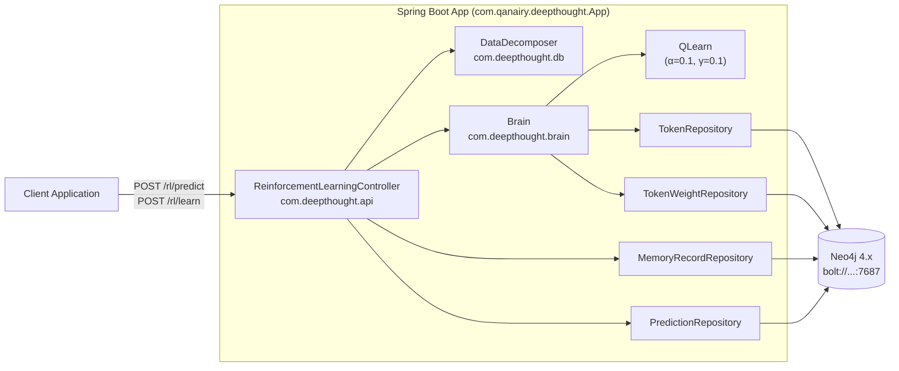
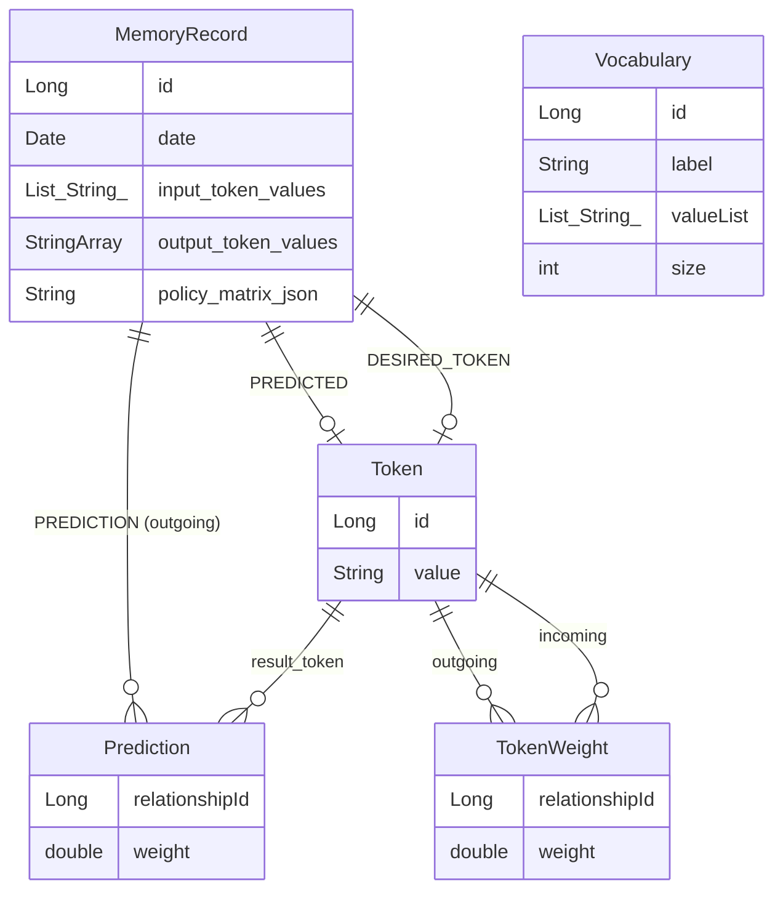
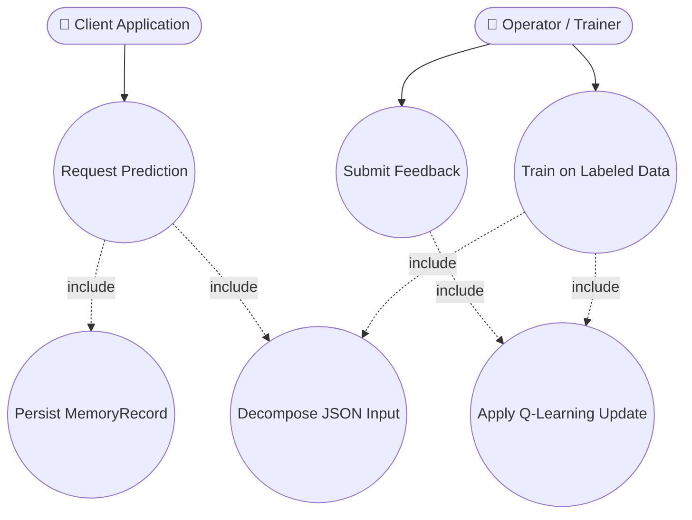
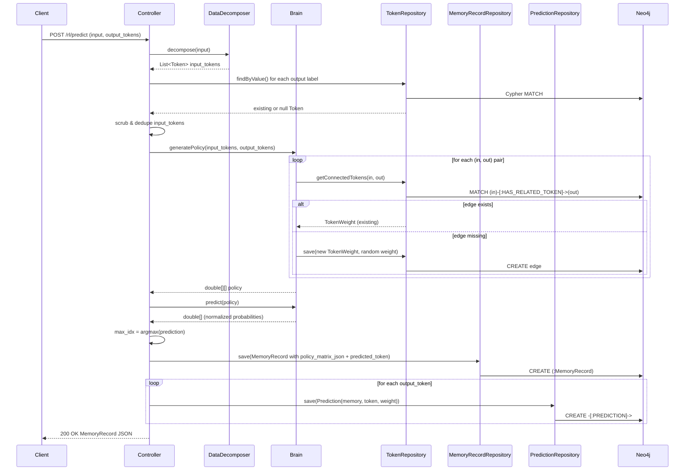
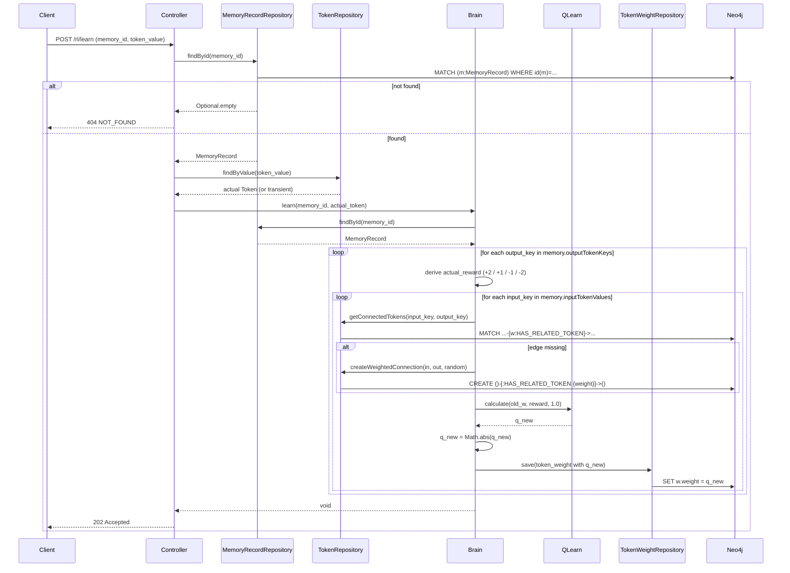

# Reinforcement Learning API — `/rl/predict` and `/rl/learn`

This document explains how Deepthought turns an HTTP request into a graph-based
prediction, and how a follow-up feedback request updates the learned policy.
It is the canonical reference for the predict→learn loop and the Neo4j data
model that backs it.

> All `file:line` citations are anchored to the source as of writing. The
> primary controller lives at
> `src/main/java/com/deepthought/api/ReinforcementLearningController.java`.

---

## 1. Overview

Deepthought is a graph-based reinforcement-learning engine. Predictions are
made by reading **`Token` → `Token`** edges out of Neo4j and treating their
weights as a policy matrix; learning is performed by writing those weights
back after the caller submits ground truth. There are no GPUs, no dense
neural networks, and no training-time/inference-time split — the same graph
that serves predictions is the graph that gets updated.

The two endpoints work as a pair:

| Endpoint | Purpose | Returns |
|---|---|---|
| `POST /rl/predict` | Score a set of candidate output labels for a given input | `MemoryRecord` (JSON) — includes the id needed to learn later |
| `POST /rl/learn`   | Apply Q-learning updates given an actual label and a prior `memory_id` | `202 Accepted`, no body |

A third endpoint, `POST /rl/train`, is a labeled-data convenience wrapper and
is not the focus of this document.

---

## 2. System Architecture



**Package layout note.** `App.java` component-scans both `com.deepthought` and
`com.qanairy`, so classes in either root are wired into the Spring context.
The controller in `CLAUDE.md` is referenced under `com.qanairy.api`, but the
file actually lives at `src/main/java/com/deepthought/api/ReinforcementLearningController.java`.
A few classes (e.g. `QLearn.java`) declare `package com.qanairy.brain;` while
sitting on disk under `com/deepthought/brain/` — a known package/path
inconsistency that does not affect runtime because Spring scans both roots.

---

## 3. Neo4j Graph Schema



**Edges in plain text:**

```
(Token {value}) -[:HAS_RELATED_TOKEN {weight}]-> (Token {value})    // TokenWeight
(MemoryRecord) -[:PREDICTION {weight}]-> (Token)                    // Prediction
(MemoryRecord) -[:PREDICTED]-> (Token)                              // chosen winner
(MemoryRecord) -[:DESIRED_TOKEN]-> (Token)                          // ground truth (set on /learn)
```

**Source references:**
- `src/main/java/com/deepthought/models/Token.java` — `@NodeEntity`
- `src/main/java/com/deepthought/models/MemoryRecord.java:22-115`
- `src/main/java/com/deepthought/models/edges/TokenWeight.java`
- `src/main/java/com/deepthought/models/edges/Prediction.java`
- `src/main/java/com/deepthought/models/edges/TokenPolicy.java` (defined but not
  used by the predict/learn flow today)
- `src/main/java/com/deepthought/models/Vocabulary.java`

---

## 4. Use-Case Diagram



**Actors**

- **Client Application** — any service calling `/rl/predict` to get a label
  ranking. Holds the returned `memory_id` if it intends to provide feedback.
- **Operator / Trainer** — the role that supplies ground truth via `/rl/learn`
  or batch labeled data via `/rl/train`.

**Use cases**

- *Request Prediction* — produces a `MemoryRecord` and a probability
  distribution over output labels.
- *Submit Feedback* — supplies the actual label after the fact; triggers the
  Q-learning update against the policy graph.
- *Train on Labeled Data* — single-shot prediction + feedback for known
  examples (out of scope for this doc).
- *Decompose JSON Input* — included by both prediction-producing flows.
- *Persist MemoryRecord* — required for any future feedback to be applicable.
- *Apply Q-Learning Update* — modifies `TokenWeight` edges in the graph.

---

## 5. `/rl/predict` — Procedure & Sequence Diagram

### 5.1 HTTP signature

```
POST /rl/predict
  ?input=<string-or-stringified-JSON>
  &output_tokens=<label1>&output_tokens=<label2>...
```

- `input` (string, **required**) — JSON object or plain text. Example:
  `{"field_1":{"field_2":"hello"}}`.
- `output_tokens` (String[], **required**) — candidate output labels to score.

Returns a `MemoryRecord` JSON.

Source: `ReinforcementLearningController.java:71-164`.

### 5.2 Procedure

1. **Decompose input** — `DataDecomposer.decompose(JSONObject)` is tried
   first; on `JSONException` it falls back to
   `DataDecomposer.decompose(String)`, which splits on whitespace.
   (`DataDecomposer.java:31-120`, controller `:76-83`).
2. **Resolve output tokens** — `TokenRepository.findByValue` for each label;
   absent labels become transient `Token` instances after stripping `[`/`]`.
   (controller `:85-97`).
3. **Scrub inputs** — drop nulls, the literal string `"null"`, blanks,
   duplicates, and any input token whose value matches an output label
   (case-insensitive). (controller `:104-120`).
4. **Build the policy matrix** — `Brain.generatePolicy(scrubbed_input_tokens, output_tokens)`
   (`Brain.java:209-252`). Matrix shape is `[input.size()][output.size()]`.
   For each `(in, out)` cell:
   - `TokenRepository.getConnectedTokens(in.value, out.value)` looks up an
     existing `HAS_RELATED_TOKEN` edge.
   - If found, the existing `TokenWeight.weight` is reused.
   - If absent, a random `[0.0, 1.0)` weight is generated and a new
     `TokenWeight` is persisted before the matrix cell is filled.
5. **Predict** — `Brain.predict(policy)` (`Brain.java:43-57`):

   ```java
   for (each output column j) {
       prediction[j] = Σ_i policy[i][j];
   }
   prediction = ArrayUtils.normalize(prediction); // Stanford CoreNLP
   ```

6. **Pick winner** — `getMaxPredictionIndex(prediction)` returns the index of
   the highest probability (`controller:198-212`).
7. **Persist `MemoryRecord`** with the policy matrix (Gson-serialized into
   `policy_matrix_json`), input token values, output token keys, and the
   chosen `predicted_token`. (controller `:147-153`).
8. **Persist `Prediction` edges** — one per output token, weighted by the
   normalized probability (controller `:156-162`).
9. **Return** the saved `MemoryRecord` as JSON. The client should retain
   `memory.id` for any future `/rl/learn` call.

### 5.3 Sequence diagram



---

## 6. `/rl/learn` — Procedure & Sequence Diagram (deep dive)

This is the section requested in detail: every step that runs when a
feedback request arrives.

### 6.1 HTTP signature

```
POST /rl/learn
  ?memory_id=<long>
  &token_value=<string>
```

- `memory_id` (long, **required**) — id of a previously returned
  `MemoryRecord`.
- `token_value` (String, **required**) — the actual/correct label.

Response: **`202 Accepted`** with empty body and reason
`"Successfully learned from feedback"`.

Source: `ReinforcementLearningController.java:176-196`.

### 6.2 Procedure (every step)

1. **Look up the `MemoryRecord`** by id via
   `MemoryRecordRepository.findById(memory_id)`. If absent, throw
   `ResponseStatusException(HttpStatus.NOT_FOUND, "Memory record not found
   for id " + memory_id)` → client sees `404`. (controller `:183-186`).
2. **Resolve the actual `Token`** — construct `new Token(token_value)`, then
   try `TokenRepository.findByValue`. If a persisted token exists, use it;
   otherwise the transient instance is passed through (no save here — the
   token is materialized later as a side effect of edge creation).
   (controller `:189-193`).
3. **Delegate to `Brain.learn(memory_id, actual_token)`**
   (`Brain.java:75-149`). Everything below happens inside `Brain.learn`.
4. **Reload the memory** inside `Brain.learn` via
   `memory_repo.findById(memory_id)` (`Brain.java:80-83`). The reload is
   redundant with step 1 today but does not affect correctness.
5. **Initialize Q-learning constants** (`Brain.java:87-93`):
   - `learning_rate = 0.1` (α)
   - `discount_factor = 0.1` (γ)
   - `estimated_future_reward = 1.0` (V_future, hard-coded)
   - Construct `QLearn q_learn = new QLearn(0.1, 0.1)`.
6. **Outer loop over `memory.getOutputTokenKeys()`** — each previously scored
   output label drives a round of updates (`Brain.java:98`).
7. **Reward selection** for the current `output_key` against the supplied
   `actual_token` and the originally `predictedToken`
   (`Brain.java:98-123`):

   | Condition | `actual_reward` |
   |---|---|
   | `output_key == actual_token AND actual_token == predicted_token` | **+2.0** (exact match) |
   | `output_key == actual_token` (correct label but not the one chosen) | **+1.0** |
   | `output_key == predicted_token AND output_key != actual_token` (false positive — the model picked it but it's wrong) | **−1.0** |
   | `output_key != actual_token` (unrelated label) | **−2.0** |
   | otherwise (unreachable in current code) | 0.0 |

   > Note the log strings vs. assigned values are inverted at lines 110–117 —
   > the log reads `REWARD :: -2` while assigning `-1.0` and vice versa. This
   > is a **logging bug**, not a math bug; the actual reward applied is the
   > assigned value. Documented here, not fixed.

8. **Inner loop over `memory.getInputTokenValues()`** (`Brain.java:126`) —
   for each `(input_key, output_key)` pair:
   1. **Set the desired token** on the memory:
      `memory.setDesiredToken(actual_token)` (`Brain.java:127`). This is set
      every iteration but never re-saved on the memory object inside this
      loop (only the edges are persisted).
   2. **Look up the edge**: `TokenRepository.getConnectedTokens(input_key, output_key)`.
   3. **Resolve the `TokenWeight`**:
      - If empty, generate `random.nextDouble()` and persist via
        `TokenRepository.createWeightedConnection(input_key, output_key, weight)`
        — this Cypher writes `(:Token {value:input_key})-[:HAS_RELATED_TOKEN
        {weight}]->(:Token {value:output_key})`.
      - Else reuse `tokens.get(0).getTokenWeights().get(0)`.
   4. **Compute the new weight** (`Brain.java:141`):

      ```java
      double q_learn_val = Math.abs(
          q_learn.calculate(token_weight.getWeight(), actual_reward, estimated_reward)
      );
      ```

      The `Math.abs` clamps weights non-negative — large negative rewards
      that *would* drive a weight below zero are reflected back into the
      positive range. This is a behavior quirk worth noting; it means a
      "wrong" edge can paradoxically end up with a higher absolute weight
      than a "correct" one if the swing is large enough.
   5. **Persist** the updated weight: `token_weight_repo.save(token_weight)`.
      Saves are **per-edge, not batched** — one Neo4j round-trip per cell.
9. **Return**. The controller emits `202 Accepted` (`controller:178`).

Total work per call: **O(|input_token_values| × |output_token_keys|)** edge
upserts.

### 6.3 The Q-learning equation, verbatim

From `src/main/java/com/deepthought/brain/QLearn.java:30-32`:

```java
public double calculate(double old_value, double actual_reward, double estimated_future_reward){
    return (old_value + learning_rate * (actual_reward + (discount_factor * estimated_future_reward)));
}
```

In math notation, with the constants this codebase uses:

$$
Q_\text{new} = Q_\text{old} + \alpha \cdot (R + \gamma \cdot V_\text{future})
            = Q_\text{old} + 0.1 \cdot (R + 0.1 \cdot 1.0)
$$

Then `Math.abs(...)` is applied at the call site.

### 6.4 What is *not* updated by `/rl/learn`

- **`Prediction` edges** created by `/rl/predict` are **immutable history**.
  They record what the model predicted at the time, not what was correct.
- **The `policy_matrix_json` snapshot** stored on the `MemoryRecord` is also
  not rewritten — it remains the as-of-prediction matrix.
- The `MemoryRecord.predictions` list and `predicted_token` are likewise
  preserved.

The only mutation is on `TokenWeight` (`HAS_RELATED_TOKEN`) edges, plus the
in-memory `desired_token` assignment on the `MemoryRecord` (which is not
explicitly re-saved by `Brain.learn`).

### 6.5 Sequence diagram



---

## 7. Q-Learning Quick Reference

- **Learning rate (α):** `0.1` — controls how aggressively new evidence
  overwrites old weights.
- **Discount factor (γ):** `0.1` — weighting on the (currently constant)
  future-reward term.
- **Future reward (V_future):** hard-coded `1.0`.
- **Reward function:** `+2 / +1 / -1 / -2` per the table in §6.2.
- **Clamp:** `Math.abs` is applied to every Q-learning result, so all
  persisted weights are non-negative.

### 7.1 Worked example

Assume an existing `(login)-[:HAS_RELATED_TOKEN {weight: 0.4}]->(button)`
edge. The user submits feedback that the actual label was `button` *and*
`button` was the predicted token (an exact match). Then:

```
R                = +2.0          (exact match)
V_future         =  1.0
γ * V_future     =  0.1 * 1.0 = 0.10
R + γ * V_future =  2.10
α * (R + γ V)    =  0.1 * 2.10 = 0.21
Q_new            =  0.40 + 0.21 = 0.61
|Q_new|          =  0.61
```

The edge weight rises from `0.40` to `0.61`.

If instead the actual label was `link` and `button` had been (wrongly)
predicted, the input-to-`button` edge would receive `R = -1.0`, giving
`Q_new = 0.40 + 0.1 * (-1.0 + 0.1) = 0.40 - 0.09 = 0.31` (still positive,
so `Math.abs` is a no-op here). Larger swings — e.g., a starting weight of
`0.05` and `R = -2.0` — produce
`Q_new = 0.05 + 0.1 * (-2.0 + 0.1) = -0.14`, which the `Math.abs` clamp
turns into `0.14`. That is the quirk called out in §6.2.

---

## 8. Error and Edge Cases

| Case | Behavior |
|---|---|
| `/rl/predict` with non-JSON `input` | Falls back to whitespace tokenization (no error). |
| `/rl/predict` output label not in DB | New (transient) `Token` is created and used; `[`/`]` chars are stripped. |
| `/rl/predict` empty `prediction` array | `getMaxPredictionIndex` throws `IllegalArgumentException` → 500. |
| `/rl/learn` unknown `memory_id` | `404 Not Found`, body message `"Memory record not found for id <id>"`. |
| `/rl/learn` unknown `token_value` | New token is created implicitly when an edge is written; no validation error. |
| Missing required query params | Spring binding error → `400 Bad Request`. |
| Q-learning weight that would go negative | Clamped to non-negative via `Math.abs`. |
| Per-edge writes | Not batched — `O(|input| × |output|)` Neo4j round-trips per `/rl/learn`. |
| Logging vs. reward mismatch in `Brain.learn` | The log message disagrees with the assigned reward at lines 110–117; values applied to weights are correct. |

---

## 9. Verification

How to confirm this document matches the running system:

1. Start Neo4j (Bolt on `:7687`) and the app: `mvn spring-boot:run`.
2. Open Swagger UI at <http://localhost:8080/swagger-ui.html> and confirm
   `POST /rl/predict` and `POST /rl/learn` show the parameters described in
   §5.1 and §6.1.
3. Make a prediction:

   ```bash
   curl -X POST 'http://localhost:8080/rl/predict' \
     --data-urlencode 'input={"page":"login"}' \
     --data-urlencode 'output_tokens=button' \
     --data-urlencode 'output_tokens=link'
   ```

   Expect a `MemoryRecord` JSON with a `predictions` array of length 2 and a
   `predicted_token`. Capture the returned `id` as `MEMORY_ID`.
4. In Neo4j Browser, confirm the edges:

   ```cypher
   MATCH (m:MemoryRecord)-[p:PREDICTION]->(t:Token)
   WHERE id(m) = $MEMORY_ID
   RETURN m, p, t;
   ```

5. Capture current weights for inspection:

   ```cypher
   MATCH (a:Token)-[w:HAS_RELATED_TOKEN]->(b:Token)
   RETURN a.value, w.weight, b.value
   ORDER BY w.weight DESC LIMIT 25;
   ```

6. Submit feedback:

   ```bash
   curl -i -X POST "http://localhost:8080/rl/learn?memory_id=$MEMORY_ID&token_value=button"
   ```

   Expect HTTP `202 Accepted` with empty body.
7. Re-run the Cypher from step 5 — the weights for the `(login → button)`
   edge family should have changed; `(login → link)` weights should have
   moved in the opposite direction.

---

## 10. Source Map

| Concern | File |
|---|---|
| HTTP entry points | `src/main/java/com/deepthought/api/ReinforcementLearningController.java` |
| Prediction & learning orchestration | `src/main/java/com/deepthought/brain/Brain.java` |
| Q-learning math | `src/main/java/com/deepthought/brain/QLearn.java` |
| Elastic vector construction | `src/main/java/com/deepthought/brain/TokenVector.java` |
| JSON → Token decomposition | `src/main/java/com/deepthought/db/DataDecomposer.java` |
| Domain entities | `src/main/java/com/deepthought/models/{Token,MemoryRecord,Vocabulary}.java` |
| Edge entities | `src/main/java/com/deepthought/models/edges/{TokenWeight,Prediction,TokenPolicy}.java` |
| Repositories (Cypher) | `src/main/java/com/deepthought/models/repository/*.java` |
| Neo4j config | `src/main/java/com/qanairy/config/Neo4jConfiguration.java` |
| Application bootstrap | `src/main/java/com/qanairy/deepthought/App.java` |
